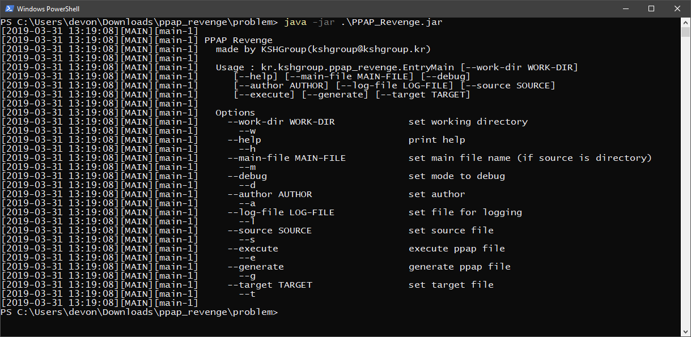
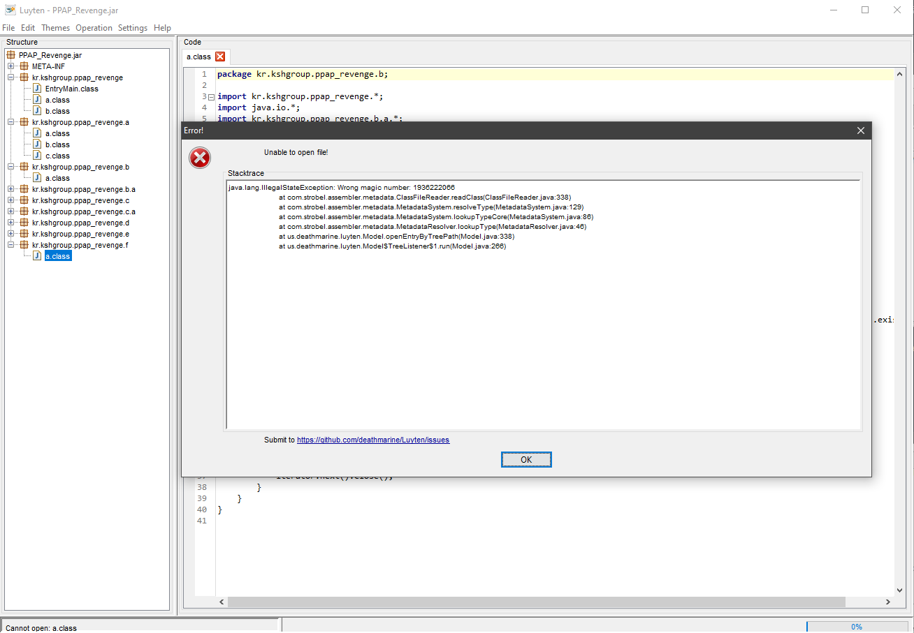
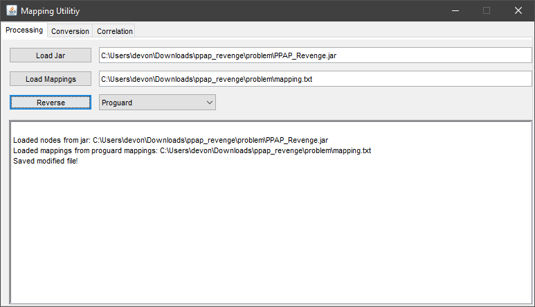

# 서론

올 겨울 해킹캠프에서 출제되었던 PPAP_Revenge를 풀어보려고 한다.

CTF 도중에 출제자님이 자꾸 풀라고 시켜서 풀려고 했지만, 딱 안잡혀서 다른 문제 잡았다.

작년 17회 해킹캠프때 더러운 자바 리버싱 문제였던 [PPAP문제](https://blog.kshgroup.kr/17th-hackingcamp-ppap/)가 1솔브인걸로 기억한다.

그떄도 딱히 어려운 자바 리버싱은 아니였지만 그 유일한 푼사람을 저격해서 PPAP_Revenge를 출제했다고 한다.

서론이 너무 길었는데 아무튼 파일들을 살펴보도록 하자.

# 살펴보기

```
problem/
  ├ PPAP_Revenge.jar
  └ PPAPie.ppap
```

`java -jar PPAP_Revenge.jar`로 실행시켜보자.



사용법과 옵션들을 보니 java 파일을 wrapping 해주는 프로그램 같다.

그리고 같이 따라온 `PPAPie.ppap` 파일이 프로그램을 실행시킨 결과로 추측된다.

# 리버싱 시도

그럼 흔히들 사용하는 jd-gui로 jar파일을 까보자.


그러면 난독화된 패키지, 클래스 명이 반겨주고 클릭하면 `// INTERNAL ERROR //`가 뜬다.

이건 그 위에 링크로 올려두었던 PPAP 문제에서도 나왔던 기법(?)인데, jd-gui가 Java 7를 사용해서 Java 8 이상의 바이트코드를 읽으려고 하면 오류가 발생하는 것이다.

그럼 Java 8 이상을 사용하는 [Luyten](https://github.com/deathmarine/Luyten)을 사용해보자.


전혀 알아볼 수 없을정도로 난독화가 되어있다.

만약 각각 클래스 이름들이 다르다면 Intellij같은 데에 올려서 리팩토링 빡세게 하면 될거지만, 클래스 이름들이 겹치는게 대부분이라 Refactor하면 다른것도 다 바뀌어버린다 ㅠㅠ

# Deobfuscation(난독화 해제)

파일들을 둘러보면 이런 걸 볼 수 있다.



.jar 파일을 압축 해제 한 뒤 `kr.kshgroup.ppap_revenge.f.a` 클래스 파일을 살펴보면 다음과 같은 bytecode가 아닌 text file이 나온다.

```
kr.kshgroup.ppap_revenge.EntryMain -> kr.kshgroup.ppap_revenge.EntryMain:
    void <init>() -> <init>
    void main(java.lang.String[]) -> main
    boolean lambda$0(java.lang.Integer) -> a
kr.kshgroup.ppap_revenge.ManagerBase -> kr.kshgroup.ppap_revenge.a:
    void initialize() -> initialize
    void close() -> close
kr.kshgroup.ppap_revenge.ProgramManager -> kr.kshgroup.ppap_revenge.b:
    java.lang.String[] args -> a
    java.util.List managers -> a
    void <clinit>() -> <clinit>
    void <init>(java.lang.String[]) -> <init>
    void initialize() -> initialize
    void close() -> close
    java.lang.String removeExtension(java.lang.String) -> a
    void run() -> run
    kr.kshgroup.ppap_revenge.ManagerBase getManager(java.lang.Class) -> a
    boolean lambda$0(java.lang.Integer) -> a
```

이게 뭔가 했더니 안드로이드 난독화로 유명한 ProGuard에서 난독화하면 함께 나오는 mapping.txt 파일이라고 한다.

그래서 mapping.txt 파일을 가지고 원래 파일로 되돌릴 수 있는 방법이 없나 구글링 해보면 나오는게 있다.

영어로 검색하면 지인짜로 안나오는게 한글로 검색하면 바로 나와서 허탈했다 -_-;;

아무튼 [이 링크](https://ddmanager.tistory.com/25)를 타고 들어가서 mapping.jar을 다운받아준다.

그리고 잘 돌리면 된다.



그리고 나서 또 Luyten으로 decompile 해보자.


정상적으로 deobfuscation이 된 것을 볼 수 있다.

# 로직 분석

이제 이 프로그램의 로직을 겁나 분석해야 한다.

핵심적으로 wrapping하기 시작하는 부분은 `kr.kshgroup.ppap_revenge.files.ppap.PPAPGenerator`에 있다. run 함수의 로직을 대충 분석해보자.

```
[준비]
a. Author와 클래스의 개수를 PPAPMeta 인스턴스에 넣어 PPAPFile.meta에 저장한다.
b. Main 소스코드를 가져와 PPAPClass 인스턴스에 넣어 PPAPFile.mainClass에 저장한다.
c. 그 외의 다른 소스코드들도 가져와 PPAPClass 인스턴스에 넣어 PPAPFile.classes에 저장한다.

[파일 구조]
1. PPAP 파일 시그니처
2. PPAPMeta
    2-1. PPAPMeta 시그니처
    2-2. 암호화 키
    2-3. author의 길이 (LE 4bytes)
    2-4. author
    2-5. (Main 클래스를 포함한) 클래스 개수 (LE 4bytes)
3. Main 클래스
    3-1. PPAPClass 시그니처 (encrypted)
    3-2. 클래스 이름의 길이 (encrypted, LE 4bytes)
    3-3. 클래스 이름 (encrypted)
    3-4. 클래스 길이 (encrypted, LE 4bytes)
    3-5. 클래스 데이터 (encrypted)
4. 다른 클래스들
    4-1. PPAPClass 시그니처 (encrypted)
    4-2. 클래스 이름의 길이 (encrypted, LE 4bytes)
    4-3. 클래스 이름 (encrypted)
    4-4. 클래스 길이 (encrypted, LE 4bytes)
    4-5. 클래스 데이터 (encrypted)
```

뒤에 encrypted가 붙은것은 암호화키로 XOR된 것이다.

# 복호화 툴 제작

그럼 이제 복호화 하는 것을 파이썬으로 짜보자.

```python
import ctypes
import os


def decrypt(l, k):
    return bytes([b ^ k for b in l])


if not os.path.exists('result/'):
    os.makedirs('result/')

with open('PPAPie.ppap', 'rb') as f:
    if f.read(2) != b'\xBB\xAB':
        print('[*] Not PPAP File')
        exit(0)

    print('[*] PPAP Signature Verified')

    if f.read(2) != b'\xBB\xAC':
        print('[*] Corrupted PPAP File')
        exit(0)

    print('[*] PPAPMeta Signature Verified')

    key = f.read(1)[0]
    print('[+] PPAP Key: ' + str(key))

    authorlen = int.from_bytes(f.read(4), byteorder='little', signed=False)

    if authorlen > 0:
        print('[+] Author: ' + f.read(authorlen).decode())
    else:
        print('[+] Author: (None)')

    classcount = int.from_bytes(f.read(4), byteorder='little', signed=False)
    print('[+] Class Count: ' + str(classcount))

    for i in range(classcount):
        print('\n== Class ' + str(i + 1))
        class_sign = f.read(2)
        if class_sign != b'\xBB\xAD' and decrypt(class_sign, key) != b'\xBB\xAD':
            print('[*] Corrupted PPAP File')
            exit(0)
        print('[*] PPAPClass Signature Verified')

        class_namelen = int.from_bytes(decrypt(f.read(4), key), byteorder='little', signed=False)
        class_name = ''.join(map(chr, decrypt(f.read(class_namelen), key)))
        print('[+] Class Name: ' + class_name)

        class_len = int.from_bytes(decrypt(f.read(4), key), byteorder='little', signed=False)
        print('[+] Class Length: ' + str(class_len))

        with open('result/' + class_name + '.class', 'wb') as f2:
            f2.write(decrypt(f.read(class_len), key))
            print('[+] Class Data saved')
```

원래 Main 클래스를 제외한 파일들에도 시그니처가 암호화 되어야 하지만 암호화 되지 않아서 그 부분 수정했다.

실행시키면 다음과 같이 나온다.

```
$ python decompile.py
[*] PPAP Signature Verified
[*] PPAPMeta Signature Verified
[+] PPAP Key: 187
[+] Author: (None)
[+] Class Count: 3

== Class 1
[*] PPAPClass Signature Verified
[+] Class Name: PPAPie
[+] Class Length: 412
[+] Class Data saved

== Class 2
[*] PPAPClass Signature Verified
[+] Class Name: FlagChecker
[+] Class Length: 1243
[+] Class Data saved

== Class 3
[*] PPAPClass Signature Verified
[+] Class Name: FlagReader
[+] Class Length: 806
[+] Class Data saved
```

# 또 다시 분석..

그리고 result 폴더에 클래스 데이터들이 놓여져 있다. 이 파일들을 Luyten에 돌리면 각각 다음과 같은 소스들이 나온다.

```java
public class PPAPie
{
    public static void main(final String[] args) {
        new FlagReader().run();
    }
}
```

```java
import java.util.*;

public class FlagReader
{
    public void run() {
        System.out.println("Input your flag : ");
        final Scanner sc = new Scanner(System.in);
        final String input = sc.nextLine();
        sc.close();
        new FlagChecker(input).run();
    }
}
```

```java
public class FlagChecker
{
    private final String input;
    private byte[] flag_check;
    
    public FlagChecker(final String input) {
        this.flag_check = new byte[] { 108, 103, 101, 105, 116, 95, 116, 116, 116, 116, 116, 116, 23, 74, 123, 116, 21, 74, 23, 123, 16, 84, 84, 72, 23, 123, 69, 84, 84, 21, 65, 123, 84, 21, 65, 123, 122, 75, 122, 123, 100, 5, 100, 5, 89 };
        this.input = input;
    }
    
    public boolean flag_check(final byte[] input, final byte[] flag) {
        if (input.length != flag.length) {
            return false;
        }
        for (int i = 0; i < flag.length; ++i) {
            if ((input[i] ^ 0x24) != flag[i]) {
                return false;
            }
        }
        return true;
    }
    
    public void run() {
        final byte[] inputBytes = this.input.getBytes();
        if (this.flag_check(inputBytes, this.flag_check)) {
            System.out.println("CORRECT!!");
        }
        else {
            System.out.println("No...");
        }
    }
}
```

FlagChecker부분의 배열들을 `0x24`로 XOR해주면 답이 나온다.

```
C:\Users\devon>python
Python 3.7.0 (v3.7.0:1bf9cc5093, Jun 27 2018, 04:06:47) [MSC v.1914 32 bit (Intel)] on win32
Type "help", "copyright", "credits" or "license" for more information.
>>> ''.join([chr(x ^ 0x24) for x in [108, 103, 101, 105, 116, 95, 116, 116, 116, 116, 116, 116, 23, 74, 123, 116, 21, 74, 23, 123, 16, 84, 84, 72, 23, 123, 69, 84, 84, 21, 65, 123, 84, 21, 65, 123, 122, 75, 122, 123, 100, 5, 100, 5, 89]])
'HCAMP{PPPPPP3n_P1n3_4ppl3_app1e_p1e_^o^_@!@!}'
```

```
FLAG: HCAMP{PPPPPP3n_P1n3_4ppl3_app1e_p1e_^o^_@!@!}
```

# 후기

굳이 파이썬으로 툴을 만들지 않아도 헥스 에디터 만으로 풀 수 있지만 이러는 편이 더 풀기 편할것 같아서 짜봤다.

이 문제를 푸는데 (풀이법을 어느 정도 알고도) 대충 1시간 반 정도 걸린것 같다.

특히 리틀엔디언 관련해서 헷갈리는게 많아서 그랬던것 같다.

좋은(?) 문제를 만들어주신 킹성훈님께 감사하다는 말 전하고 싶다.