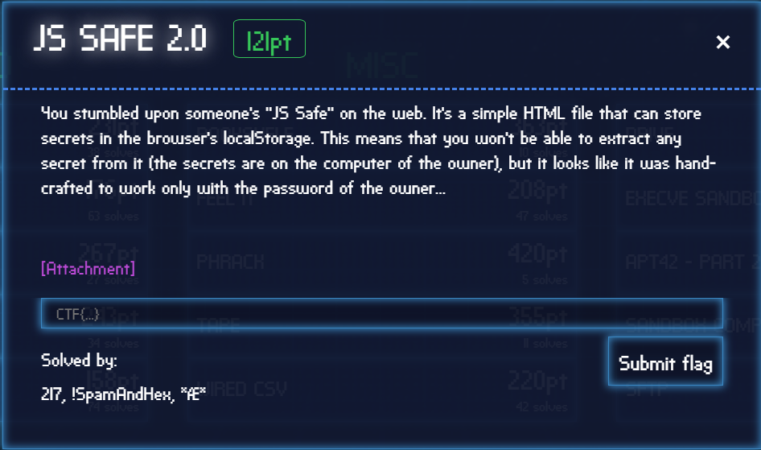
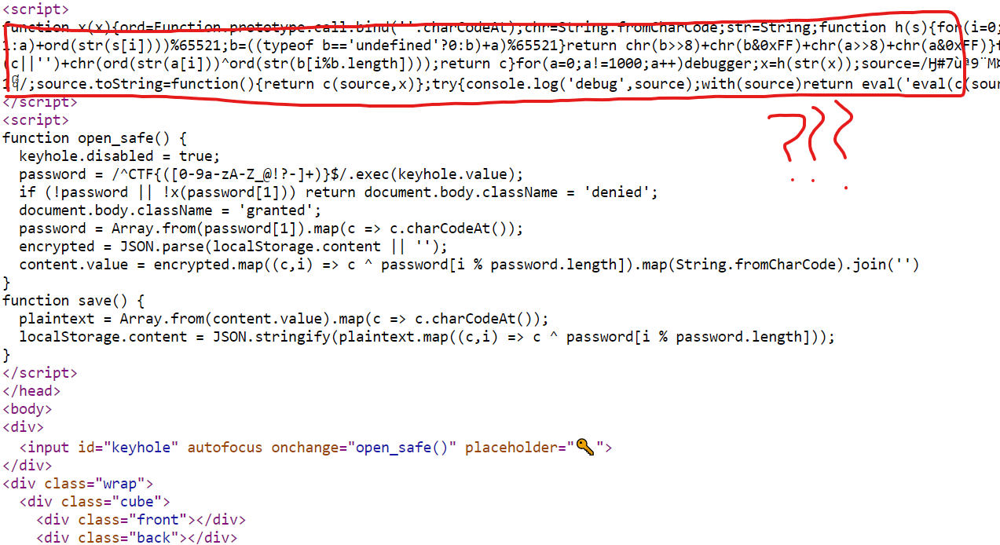
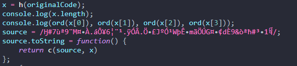
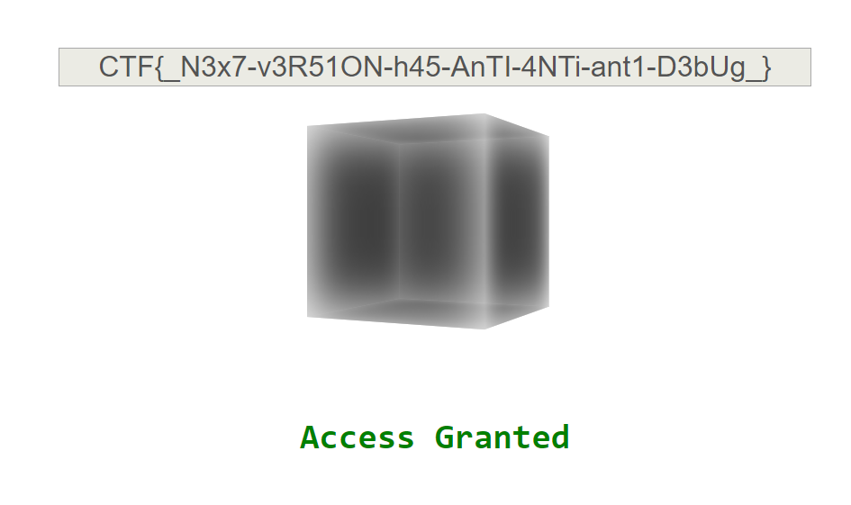

# 서론

자바스크립트를 사랑하는 나는 자바스크립트를 사용한 재밌는 문제가 있나 살펴 보던 도중 재밌는 문제가 보여 풀어본다.



솔버수(103 솔버)도 적당하고 그러하니 좀만 삽질 하면 풀리겠지라고 생각했다. (과연)

# 살펴보기

파일로 html파일 하나를 던져준다.


일단 key를 입력받는 곳이 있고, 그 밑에는 돌아가는 큐브가 하나 있다.

# 소스 분석

소스를 한번 보자.



뭔가 심각하게 난독화된 부분이 위에 있다.. 하지만 우리는 일단 밑에 있는 코드부터 분석해보자.

```javascript
function open_safe() {
  // 입력 부분을 비활성화한다.
  keyhole.disabled = true;
  // 입력값을 regex돌려서 저장한다.
  password = /^CTF{([0-9a-zA-Z_@!?-]+)}$/.exec(keyhole.value);
  // 위 regex에 일치하지 않거나, x함수를 실행한 값이 falsy하다면 denied한다. 
  if (!password || !x(password[1])) return document.body.className = 'denied';
  // 아니라면 granted한다.
  document.body.className = 'granted';
  password = Array.from(password[1]).map(c => c.charCodeAt());
  encrypted = JSON.parse(localStorage.content || '');
  content.value = encrypted.map((c,i) => c ^ password[i % password.length]).map(String.fromCharCode).join('')
}
```

중요한 부분을 주석처리 해보았다. 가장 중요한 부분은 검증하는 것으로 보이는 난독화된 x함수인듯 하다.

일단 난독화된 부분을 beautifier에 돌려보자.

```javascript
function x(х) {
    ord = Function.prototype.call.bind(''.charCodeAt);
    chr = String.fromCharCode;
    str = String;

    function h(s) {
        for (i = 0; i != s.length; i++) {
            a = ((typeof a == 'undefined' ? 1 : a) + ord(str(s[i]))) % 65521;
            b = ((typeof b == 'undefined' ? 0 : b) + a) % 65521
        }
        return chr(b >> 8) + chr(b & 0xFF) + chr(a >> 8) + chr(a & 0xFF)
    }

    function c(a, b, c) {
        for (i = 0; i != a.length; i++) c = (c || '') + chr(ord(str(a[i])) ^ ord(str(b[i % b.length])));
        return c
    }
    for (a = 0; a != 1000; a++) debugger;
    x = h(str(x));
    source = /Ӈ#7ùª9¨M¤ŸÀ.áÔ¥6¦¨¹.ÿÓÂ.։£JºÓ¹WþʖmãÖÚG¤…¢dÈ9&òªћ#³­1᧨/;
    source.toString = function() {
        return c(source, x)
    };
    try {
        console.log('debug', source);
        with(source) return eval('eval(c(source,x))')
    } catch (e) {}
}
```

일단 위에 선언된 `ord`, `chr`, `str` 함수는 각각 Python의 Built-in Function과 같은 역할을 하는것 같다.

h함수는 무언가를 하는것 같지만 얼핏 봐서는 어떤 역할을 하는지 알 수 없다.

c함수는 a, b, c를 인자로 받아서 XOR 연산을 하는것 같다.

그리고 그다음 a에서 debugger함수를 1000번 실행시킨다.

이 부분에서 우리가 Chrome Devtools 같은거로 돌리면 디버거가 1000번을 다 돌기 떄문에 Anti-Debugging 용으로 넣은것 같다.

그리고 source는 이름 모를 regex가 있고, console.log를 하게 되면서 source.toString을 호출해 c함수를 호출할 것 같다.

# 고난 1

그러면 `for (a = 0; a != 1000; a++) debugger;` 부분을 지우고 h함수가 실행된 다음줄에 Breakpoint를 걸고 실행해보자.


이렇게 나오는데 솔직히 `x = h(str(x));` 이 statement가 이해가 안갔다. 저 x가 parameter의 x인지 function name의 x인지 헷갈렸다.

하지만 h함수에 Breakpoint를 걸어보니 `str(x)`는 x함수의 소스코드가 담겨져 h함수에 들어가게 되었다.

잘은 모르겠지만 h함수에서 소스코드를 가져오니 의도된 결과값을 가져오려면 원래 소스코드를 넣어야 겠다는 생각이 들었다.

그래서 원래 html 파일에서 `x.toString()` 값을 `str(x)`와 치환해주었다.


이런식으로 말이다. 하지만 그래도 x값은 다르지 않았다.. ㅠㅠ

# 고난 2

또 원본 코드를 돌리다가 발견한건데 h함수의 undefined 검증 부분에서 의심을 품었다가... debugger 부분이 실행될때 a가 처음 선언된다는것을 깜빡했었다!

그래서 a는 1000인 상태로 있는것이다. debugger자리에 a를 1000으로 선언해준다.

그리고 debugger에서의 x가 왜 항상 같은지 생각해보니 함수 안의 scope에서는 x가 올바르지만 디버거에서는 x의 parameter인 x를 가져오는 것이다. (내가 말하면서도 무슨 말인지 잘 모르겠다 🤷‍)

아무튼 함수 내에서 console.log로 출력해보면 다음과 같이 알 수 없는 문자가 나온다.


이 문자를 chr로 확인해보자.



돌리면 `130 30 10 154`가 나온다. 그리고 이 값을 가지고 c함수에서 XOR을 하는것 같다.

그리고 with statement를 써서 source.source를 사용하면 regex의 원형이 나오는것을 source로 대체할 수 있게 만들었다. (그래서 더 헷갈린다)


이제 c함수의 return 쪽에 Breakpoint를 걸고 실행해보면 c값이 나온다.

```javascript
х==c('¢×&Ê´cʯ¬$¶³´}ÍÈ´T—©Ð8ͳÍ|Ԝ÷aÈÐÝ&›¨þJ',h(х))//᧢
```

그럼 어떻게 하면 위 식을 참으로 만드는 값을 얻을 수 있을까..?

# 구글에서 냈으니 구글링을..

일단 h함수의 정체를 알아야 할 필요를 느꼈다. (이제서야??)

코드에서 나머지 연산을 하는 숫자 65521를 구글링했더니 Adler-32라는 Checksum Algorithm이 나왔다.

알고보니 우리가 저번에 발견했던 `130 30 10 154` 이 숫자들이 checksum이었던것 같다.

하지만 두번째 checksum은 최종 key를 모르니까 브루트포싱을 해야할 것 같다.

4바이트고 나오는 문자들이 미리 regex로 주어져 있으니 범위 내에서 브루트포싱이 가능하지 않을까?

한번 시도해보자.

일단 `¢×&Ê´cʯ¬$¶³´}ÍÈ´T—©Ð8ͳÍ|Ԝ÷aÈÐÝ&›¨þJ` 문자열의 정확한 hex값을 얻어야겠다.


이렇게 얻은 값을 가지고 브루트포싱하는 코드를 짜보자.

```python
import re
import binascii

a = [1093, 61, 61, 99, 40, 39, 162, 215, 38, 129, 202, 180, 99, 202, 175, 172, 36, 182, 179, 180, 125, 205, 200, 180, 84, 151, 169,
     208, 56, 205, 179, 205, 124, 212, 156, 247, 97, 200, 208, 221, 38, 155, 168, 254, 74, 39, 44, 104, 40, 1093, 41, 41, 47, 47, 6626][6:-10]


whitelists = []

for i in range(4):
    temparr = []
    bundle = [a[x] for x in range(i, len(a), 4)]
    for j in range(0xff + 1):
        if re.match(r'^([0-9a-zA-Z_@!?-]+)$', ''.join([chr(v ^ j) for v in bundle])):
            temparr.append(j)
    whitelists.append(temparr)


for i in whitelists[0]:
    for j in whitelists[1]:
        for k in whitelists[2]:
            for l in whitelists[3]:
                key = chr(i) + chr(j) + chr(k) + chr(l)
                print('Key: ' + binascii.hexlify(key.encode()).decode())
                print('Value: ' + ''.join([chr(value ^ ord(key[idx % 4])) for idx, value in enumerate(a)]))
```

실행시키면 다음과 같은 결과가 나온다.

```
$ python flag.py
Key: c3bdc29515c3b9
Value: _B3x7!v3R91ON!h45!AnTE-4NXi-abt1-H3bUk_
Key: c3bdc29915c3b9
Value: _N3x7-v3R51ON-h45-AnTI-4NTi-ant1-D3bUg_
```

하지만 누가봐도 두번째 것이 맞는것 같으므로 이걸 형식에 맞추어 넣어보자.




```
FLAG: CTF{_N3x7-v3R51ON-h45-AnTI-4NTi-ant1-D3bUg_}
```

# 소감..?

Javascript로 이렇게 복잡하게 문제를 만들수 있을 줄이야 몰랐다.

풀어야 겠다고 생각하고 라업까지 쓰기까지 3시간이 걸려버렸다! 확실히 어려운 문제 푸는게 쾌감이 개쩌는것 같다 헤헤

확실히 Google에서 만든거라 듣도보도 못한 Javascript Anti-Debugging 관련해서 많은것을 알 수 있었다.

p.s. 풀고 나서 다른 사람 라업보다가 알게 된건데 많은 x들이 scope에 겹치지 않고 나타난게 키릴문자 x여서 겹치지 않고 쓰일 수 있었다고 한다. 조금만 더 주의깊게 봤다면 알 수 있었을텐데..

그리고 다양한 안티디버깅 기법이 더 사용되었는데 별로 신경쓰지 않았던것 같다(?)