# Timisoara CTF 2019 Write-up

I played Timisoara CTF. I think well-played. Let's go.

# Challenge List

- Crypto
    - Proof of work (100pts)
    - Alien Alphabet (150pts)
    - TimCTF gamblig service (200pts)
    - Don't trust time (200pts)
- Programming
    - Linear recurrence (200pts)
- Reverse Engineering
    - Easy Rev (75pts)
    - Boz Packer (150pts)
    - Math (150pts)
    - Pipes (200pts)
    - Strange Jump (250pts)
    - Evil Minecraft mod (500pts)
- Web
    - Admin panel (200pts)

# Crypto

## Proof of work (100pts)

The term "Proof of work" is using in cryptocurrency. And, Bitcoin is one of the biggest cryptocurrency that uses SHA256. So, I googled with  `bitcoin mined hash` and it takes me to [this website](https://en.bitcoin.it/wiki/Block_hashing_algorithm). Then, there is an example hash for Bitcoin.

```python
>>> import hashlib
>>> header_hex = ("01000000" +
    "81cd02ab7e569e8bcd9317e2fe99f2de44d49ab2b8851ba4a308000000000000" +
    "e320b6c2fffc8d750423db8b1eb942ae710e951ed797f7affc8892b0f1fc122b" +
    "c7f5d74d" +
    "f2b9441a" +
    "42a14695")
>>> header_bin = header_hex.decode('hex')
>>> print hashlib.sha256(header_bin).digest()
'\xb9\xd7QS5\x93\xac\x10\xcd\xfb{\x8e\x03\xca\xd8\xba\xbcg\xd8\xea\xea\xc0\xa3i\x9b\x82\x85}\xac\xac\x93\x90'
```

And, I send it into the netcat server, and Boom!

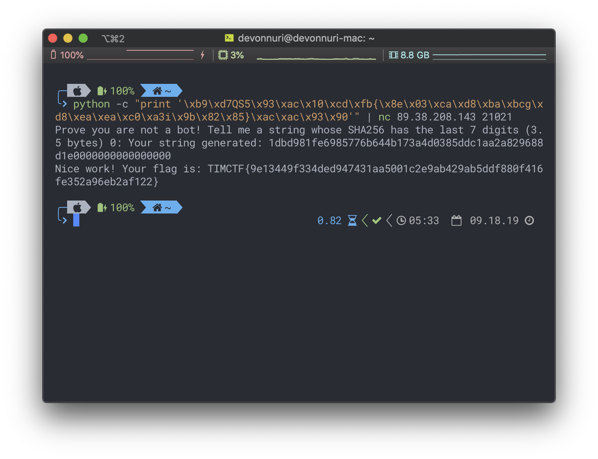

> FLAG: TIMCTF{9e13449f334ded947431aa5001c2e9ab429ab5ddf880f416fe352a96eb2af122}

## Alien Alphabet (150pts)

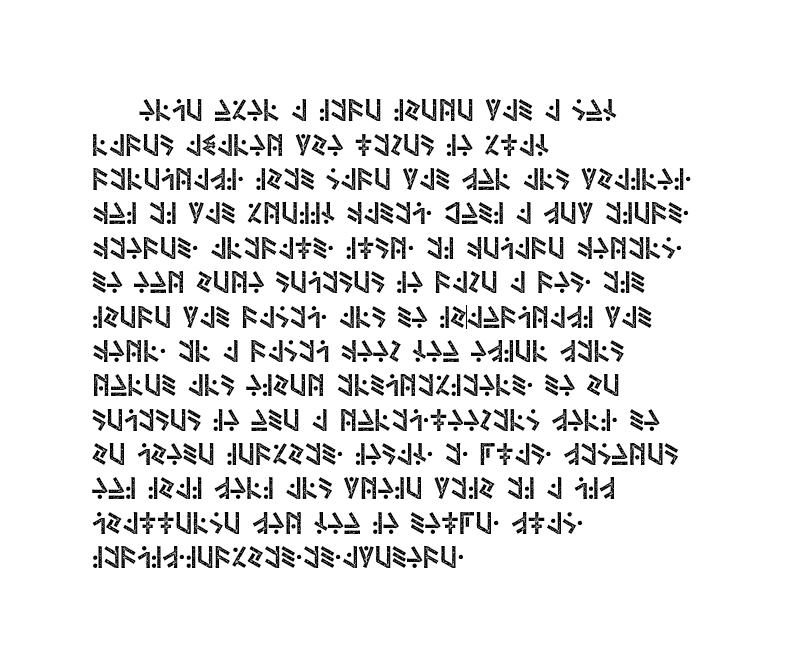

I solved it before the challenge changed, but I lost the image that I solved. So, I am solving again with a new challenge. And, the flag could be incorrect. Sorry about that.

It seems like Scandinavian runes, but its shape was not exactly same with the original. And, the first word of the last line looks like TIMCTF, so I think it could be a substitution cipher.

And, here is the key sentences that I could guess the whole flag.

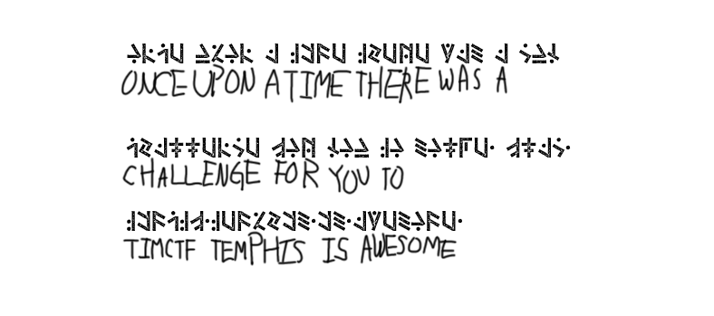

> FLAG: TIMCTF{TEMPHIS IS AWESOME}

## TimCTF gamblig service (200pts)

Usually, when using random functions, the current time is passed into the seed. At a glance, I thought I could use it to predict the next number.

When the seed prediction is failed, it will exit automatically.

Different libc can vary the pseudorandom number generator, but hopefully it works fine.

```python
from pwn import *
from ctypes import *

r = remote('89.38.208.143', 21023)

libc = cdll.LoadLibrary('libc.so.6')
libc.srand(libc.time(None))
computed = libc.rand()

r.recvuntil('Your choice: ')
r.sendline('1')
real = int(r.recvline().strip())
if real != computed:
    print '[*] Hmm.. Try one more time'
    quit()
r.recvuntil('Your choice: ')
r.sendline('2')
r.recvuntil('Enter your guess: ')
r.sendline(str(libc.rand()))
```

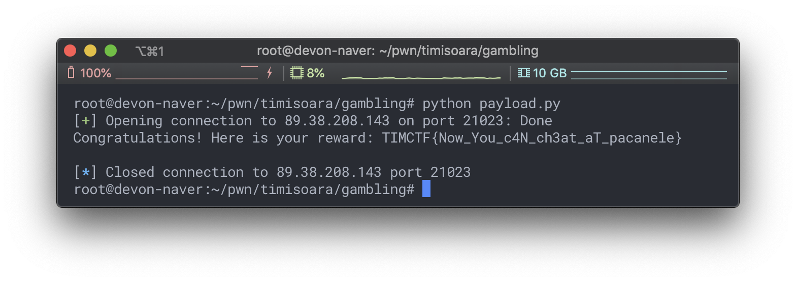

> FLAG: TIMCTF{Now\_You\_c4N\_ch3at\_aT\_pacanele}

## Don't trust time (200pts)

Modify the encrypt source code to decrypt and iterate it reversely from current time until the starting several bytes are in the flag format.
```cpp
#include <iostream>
#include <fstream>
#include <iomanip>
#include <cstring>
#include <ctime>
#include <cctype>
#include <openssl/aes.h>
#include <openssl/sha.h>

unsigned char iv[16] = {0};
unsigned char key[20];

using namespace std;

int main(int argc, char * argv[])
{
    ifstream in;
    in.open("enc_flag.txt", ios::in | ios::binary | ios::ate);
    int filesize = in.tellg();
    if(filesize == -1)
    {
        cout<<"Unable to open file!\n";
        return 0;
    }
    in.seekg(0, in.beg);

    auto *image = new unsigned char [filesize + 100];
    auto *dec = new unsigned char [filesize + 100];

    memset(image, 0, filesize + 100);
    int padded = (filesize + 16) & 0xFFFFFFFFFFFFFFF0LL;

    in.read ((char *)image, filesize);
    in.close();

    uint32_t current = time(0) - 24*3600;

    for (uint32_t seed = current; seed >= current - 200000000; seed--) {
        SHA1((const unsigned char *)&seed, 4, key);
        AES_KEY dec_key;
        AES_set_decrypt_key(key, 128, &dec_key);
        AES_cbc_encrypt(image, dec, padded, &dec_key, iv, AES_DECRYPT);

        cout << seed << ": " << dec << endl;

        if (dec[0] == 'T' && dec[1] == 'I' && dec[2] == 'M' && dec[3] == 'C') {
            break;
        }
    }
    return 0;
}
```

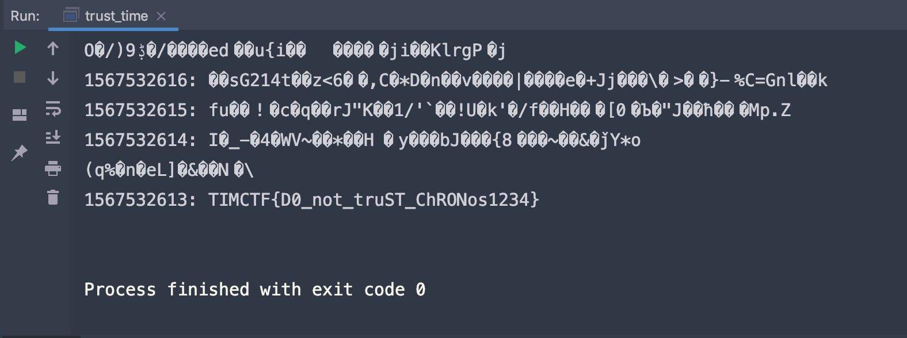

> FLAG: TIMCTF{D0\_not\_truST\_ChRONos1234}

# Programming

## Linear recurrence (200pts)

Kitamasa method(きたまさ法) is used to quickly calculate the nth term of linear recurrence like below.

$$a_{n}=\sum_{k=1}^{m}a_{n-k}c_{k}$$

And, when you calculate it with simple matrix product, it will take $O(n^3\log{}n)$, but if you use Kitamasa method it will take $O(n^2\log{}n)$.

When you make an equation for $a_{2n}$, it looks like below.

$$a_{2n}=\sum_{k=1}^{m}a_{n+k}d_{k}=\sum_{k=1}^{m}\sum_{j=1}^{m}a_{j+k}d_{j}d_{k}$$

Convert equation $a_{n}$ to equation $a_{2n}$ which costs $O(m^2)$ and we can finally calculate nth term of linear recurrence in $O(m^2\log{}n)$.

- References
    - [https://cubelover.tistory.com/?page=3](https://cubelover.tistory.com/?page=3)
    - [https://junis3.tistory.com/27](https://junis3.tistory.com/27)

First, I implemented with C++, and run it in python using subprocess module.

```cpp
#include <iostream>

using namespace std;

typedef unsigned long long ull;

const int P = 666013;

ull a[1001];
ull c[1001];
ull d[1001];
ull t[2002];

void Kitamasa(int n, int m) {
    int i, j;
    if (n == 1) {
        d[1] = 1;
        for (i = 2; i <= m; i++) d[i] = 0;
        return;
    }
    if (n & 1) {
        Kitamasa(n ^ 1, m);
        j = d[m];
        for (i = m; i >= 1; i--) d[i] = (d[i - 1] + c[m - i + 1] * j) % P;
        return;
    }
    Kitamasa(n >> 1, m);
    for (i = 1; i <= m + m; i++) t[i] = 0;
    for (i = 1; i <= m; i++) for (j = 1; j <= m; j++) t[i + j] = (t[i + j] + d[i] * d[j]) % P;
    for (i = m + m; i > m; i--) for (j = 1; j <= m; j++) t[i - j] = (t[i - j] + c[j] * t[i]) % P;
    for (i = 1; i <= m; i++) d[i] = t[i];
}

int main() {
    ull i, n, m, r;
    cin >> m >> n;
    for (i = 1; i <= m; i++)
        cin >> c[i] >> a[m-i+1];
    Kitamasa(n, m);
    r = 0;
    for (i = 1; i <= m; i++) r = (r + (long long)a[i] * d[i]) % P;
    cout << r; 
}
```

```python
from pwn import *
import subprocess

context.log_level = 'DEBUG'

r = remote('89.38.208.143', 22022)

for i in range(10):
    r.recvuntil('/10:\n')
    inp = r.recvline().rstrip() + ' ' + r.recvline().rstrip()
    proc = subprocess.Popen(['./solve'], stdin=subprocess.PIPE, stdout=subprocess.PIPE, stderr=subprocess.PIPE)
    result = proc.communicate(input=inp)[0]
    r.sendline(result)
print(r.recv())
```

```
FLAG: TIMCTF{Matrix_multiplication_OP_please_n3rf}
```

# Reverse Engineering

## Easy Rev (75pts)

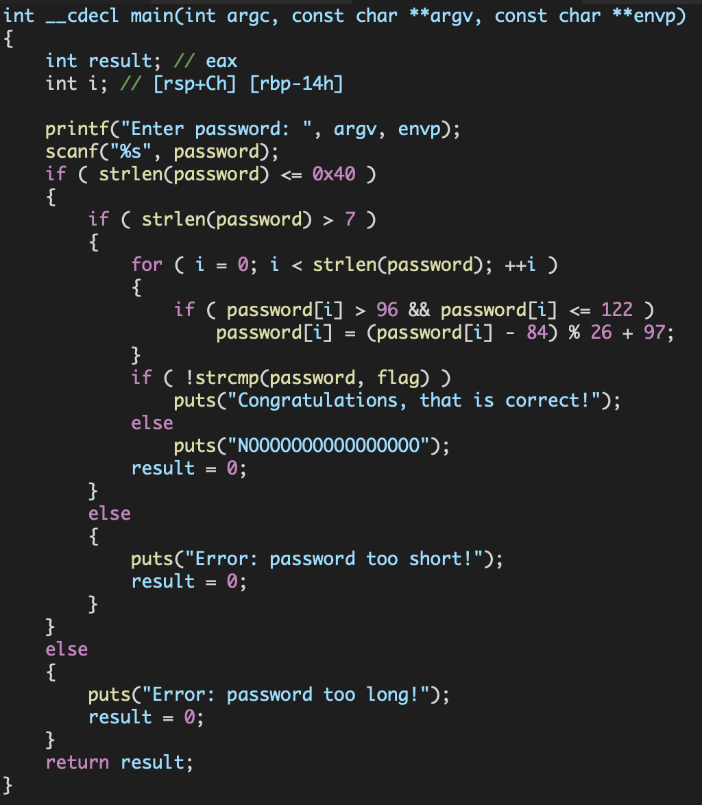

Seems like ROT13 program, because `97 - 84 = 13`. EZ MATH

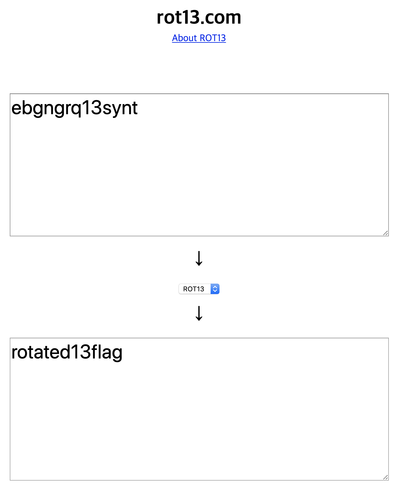

> FLAG: TIMCTF{rotated13flag}

## Boz Packer (150pts)

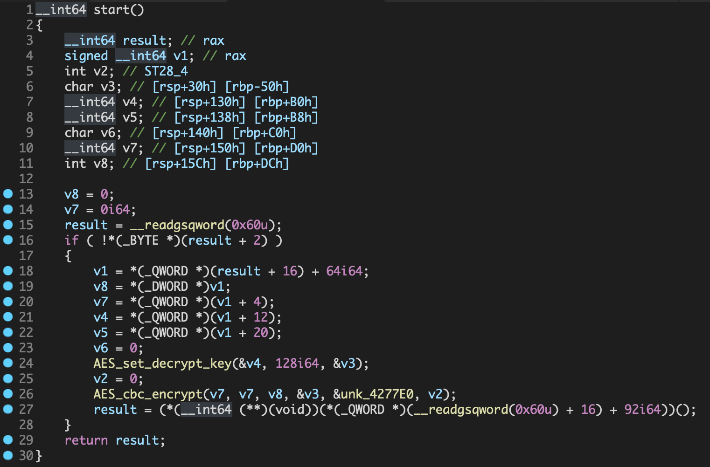

It seems it decrypts its own code on runtime. So, we should get the binary after the decryption. We can use x64dbg for debugging 64bit PE file.

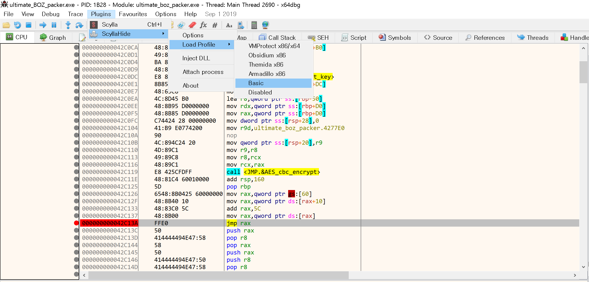

I used Anti-anti-debugging tool ScyllaHide([https://github.com/x64dbg/ScyllaHide](https://github.com/x64dbg/ScyllaHide)).

And, I set a breakpoint right after the decryption.

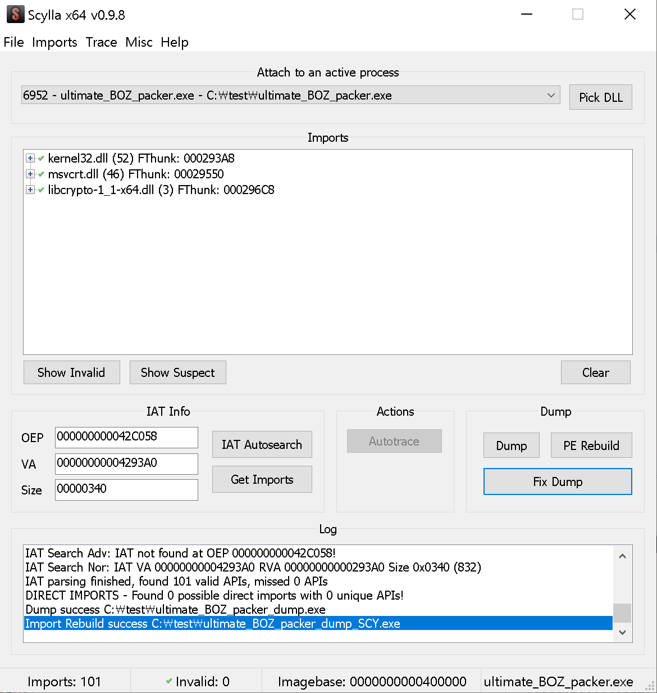

When you are on the breakpoint, run Scylla, the binary dump tool, to dump the decrypted binary.
```c
__int64 sub_40163E()
{
    __int64 result; // rax
    FILE *v1; // rax
    char v2[48]; // [rsp+20h] [rbp-50h]
    char v3[19]; // [rsp+50h] [rbp-20h]
    char v4; // [rsp+63h] [rbp-Dh]
    int v5; // [rsp+64h] [rbp-Ch]
    int j; // [rsp+68h] [rbp-8h]
    int i; // [rsp+6Ch] [rbp-4h]

    sub_40B520();
    if ( IsDebuggerPresent() != 0 )
        return 0i64;
    printf("Enter password: ");
    v1 = (FILE *)off_41C070(0i64);
    fgets(Buf, 256, v1);
    sub_41A630(&unk_427060, "b9ece18c950afbfa6b0fdbfa4ff731d3");
    sub_41A630(&unk_427080, "dd7536794b63bf90eccfd37f9b147d7f");
    sub_41A630(&unk_4270A0, "69691c7bdcc3ce6d5d8a1361f22d04ac");
        // ...
    sub_41A630(&unk_427780, "eb9f3b7bd4c4188c9f3e63368b090c9e");
    sub_41A630(&unk_4277A0, "75d35fc172579f264c559b92a37a45d8");
    sub_41A630(&unk_4277C0, "001729aeb2c3d5566625244982a2c23d");
    v5 = strlen(Buf) - 1;
    Buf[v5] = 0;
    if ( (_byteswap_ulong(__ROR4__(-(_byteswap_ulong(~(__ROL4__(v5 ^ 0x66882635, 2) + 4421671)) ^ 0x1234) - 577, 7)) + 1) >> 2 == 973616183 )
    {
        v5 = strlen(Buf);
        for ( i = 0; i < v5; ++i )
        {
            v4 = Buf[i];
            MD5(&v4, 1i64, v3);
            for ( j = 0; j <= 15; ++j )
                sprintf(&v2[2 * j], "%02x", (unsigned __int8)v3[j]);
            sub_41A630(&unk_427040, v2);
            if ( (unsigned __int8)sub_41AF10(&unk_427040, (char *)&unk_427060 + 32 * i) )
            {
                puts("NOOOOOOOOO");
                return 0i64;
            }
        }
        puts("Congratulations, you got the flag!");
        result = 0i64;
    }
    else
    {
        puts("NOOOOOOOOO");
        result = 0i64;
    }
    return result;
}
```

When you disassemble again, there is the code. It hashes with MD5 in each character.

So, we can make a character-MD5 table and run it.

```python
def md5(text):
    enc = hashlib.md5()
    enc.update(text)
    return enc.hexdigest()

table = {}
for ch in string.printable:
    table[md5(ch)] = ch

result = ''
for _hash in flag:
    if _hash in table:
        result += table[_hash]

print ''.join(result)
```

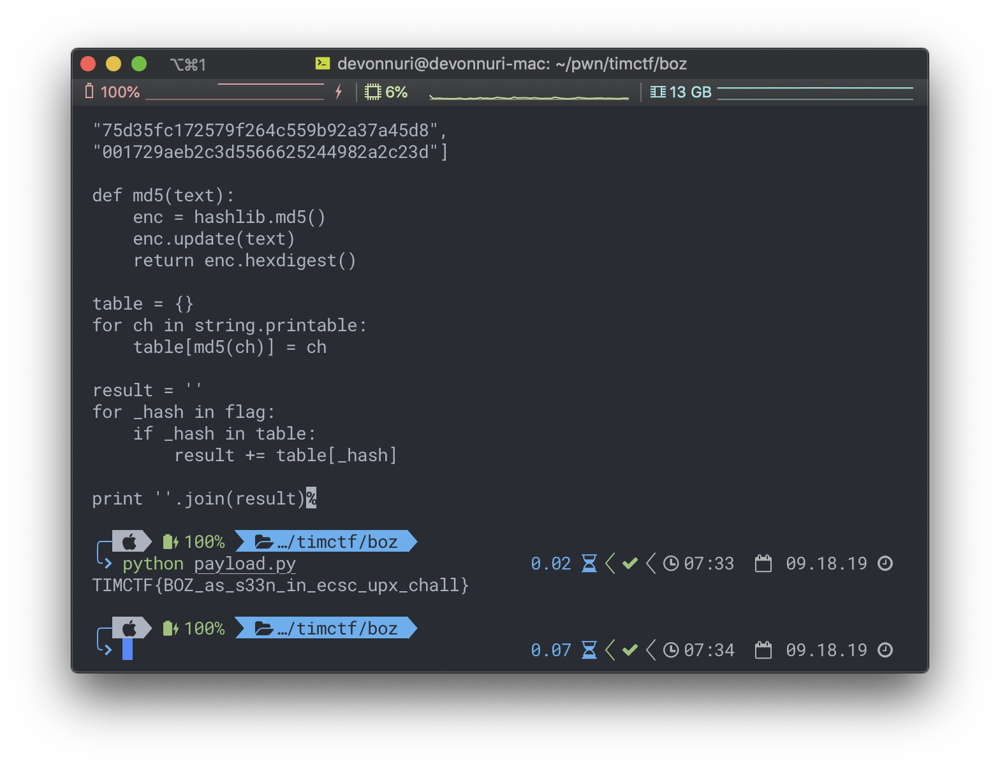

> FLAG: TIMCTF{BOZ\_as\_s33n\_in\_ecsc\_upx\_chall}

## Math (150pts)

```c
int __cdecl main(int argc, const char **argv, const char **envp)
{
    int result; // eax
    unsigned __int8 v4; // [rsp+2h] [rbp-2Eh]
    char v5; // [rsp+3h] [rbp-2Dh]
    int v6; // [rsp+4h] [rbp-2Ch]
    int v7; // [rsp+8h] [rbp-28h]
    int i; // [rsp+Ch] [rbp-24h]
    signed int j; // [rsp+10h] [rbp-20h]
    signed int k; // [rsp+14h] [rbp-1Ch]
    signed int l; // [rsp+18h] [rbp-18h]
    int m; // [rsp+1Ch] [rbp-14h]

    printf("Enter password: ", argv, envp);
    scanf("%s", plaintext);
    if ( strlen(plaintext) <= 0x100 )
    {
        v7 = 0;
        v5 = 0;
        for ( i = 0; i < strlen(plaintext); i += 3 )// iterate by 3
        {
            v6 = key ^ (plaintext[i + 2] | ((plaintext[i + 1] | (plaintext[i] << 8)) << 8));// combine 3 bytes and xor with key
            for ( j = 0; j <= 2; ++j )
            {
                if ( !plaintext[i + j] )        // is padding needed
                    v5 = 1;
            }
            for ( k = 3; k >= 0; --k )          // iterate by 4
            {
                v4 = 0;
                for ( l = 5; l >= 0; --l )      // get a block within 4 blocks
                {
                    if ( v6 & (1 << (6 * k + l)) )
                        v4 |= 1 << l;
                }
                if ( v4 )
                {
                    ciphertext[v7] = base64[v4];
                }
                else if ( v5 )                  // if padding needed, print '='
                {
                    ciphertext[v7] = '=';
                }
                else
                {
                    ciphertext[v7] = 'A';
                }
                ++v7;
            }
        }
        for ( m = 0; flag[m]; ++m )
        {
            if ( flag[m] != ciphertext[m] )
            {
                puts(no);
                return 0;
            }
        }
        puts(yes);
        result = 0;
    }
    else
    {
        puts("Error: password too long!");
        result = 0;
    }
    return result;
}
```

If you can analyze the logic of the disassembled code, it isn't hard to get inverse of it.

Encryption is processed with these steps.

1. Get 3*8 bits(3 bytes) from input
2. Split into 4 blocks with getting rid of upper 2 bits (3*8 bits ⇒ 4*6 bits)
3. Process base64 with the each 4 blocks

And, we can get flag in reverse order.

    base64 = 'ABCDEFGHIJKLMNOPQRSTUVWXYZabcdefghijklmnopqrstuvwxyz0123456789+/'
    flag = 'jveimeqpofewqY3chceAr+G6tPqKiM27u/CLhcbX7MPv'
    
    result = ''
    for block in [flag[i:i+4] for i in range(0, len(flag), 4)]:
        joined = int(''.join([bin(base64.index(c))[2:].rjust(6, '0') for c in block]), 2) ^ 0xDABEEF
        joined = bin(joined)[2:].rjust(24, '0')
        result += ''.join([chr(int(joined[i:i+8], 2)) for i in range(0, len(joined), 8)])
    print result

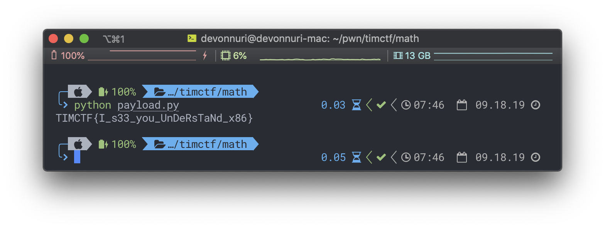

> FLAG: TIMCTF{I\_s33\_you\_UnDeRsTaNd\_x86}

## Pipes (200pts)

There are two pipes in this program.

1. Pipe 1 : Encrypt the input
2. Pipe 2 : Verify the input

Let's see input encryption code.

```c
for ( j = 0; j <= 39; ++j )
{
    buf = 0;
    if ( read(pipe_1[0], &buf, 1uLL) <= 0 )
    {
        std::operator<<<std::char_traits<char>>(&_bss_start, "C: Read failed!\n");
        return 0;
    }
    buf += 96;
    rol(&buf, 2);
    buf ^= 0x7Fu;
    buf = ~buf;
    v6 = 237 * buf;
    write(fd, &v6, 4uLL);
}
```
Encryption goes with these steps.

1. Plus 96
2. Rotate Left 2
3. Xor 0x7F
4. Not
5. Multiply 237

Then we can get flag in reverse order.

I prefer Python to C, but I had to use C for bitwise operation.
```c
#include <bits/stdc++.h>

using namespace std;

unsigned char ror(unsigned char n, unsigned int d) {
    return (n >> d)|(n << (8 - d));
}

int main() {
    unsigned int flag[40] = {
        0x000035B2, 0x0000B39A, 0x000074A6, 0x0000AD1F, 0x0000BEB6, 0x0000BEB6, 0x00008817, 0x000074A6,
        0x00008F7F, 0x0000B0D3, 0x0000BBEF, 0x000074A6, 0x0000B487, 0x00009A9B, 0x00003D1A, 0x00008BCB,
        0x000074A6, 0x00009A9B, 0x00008F7F, 0x000074A6, 0x0000C357, 0x000096E7, 0x00008BCB, 0x0000BBEF,
        0x00008BCB, 0x000074A6, 0x00009A9B, 0x0000BFA3, 0x000074A6, 0x000035B2, 0x0000B39A, 0x000074A6,
        0x0000B487, 0x0000232E, 0x0000B487, 0x0000145E, 0x0000CE73, 0x0000145E, 0x00008BCB, 0x000010AA
    };

    for (unsigned int i : flag) {
        unsigned char ch = i / 236;
        ch = ~ch;
        ch ^= 0x7F;
        ch = ror(ch, 2);
        ch -= 96;
        cout << ch;
    }

    return 0;
}
```
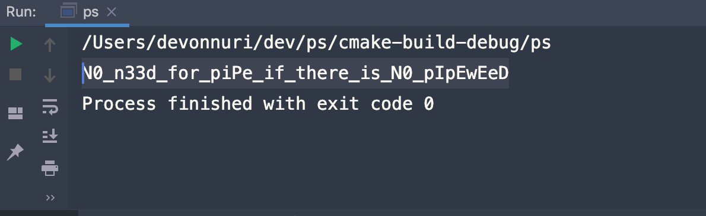

> FLAG: TIMCTF{N0\_n33d\_for\_piPe\_if\_there\_is\_N0\_pIpEwEeD}

## Strange Jump (250pts)

There is hidden function that does actual action in `sub_B9A`.

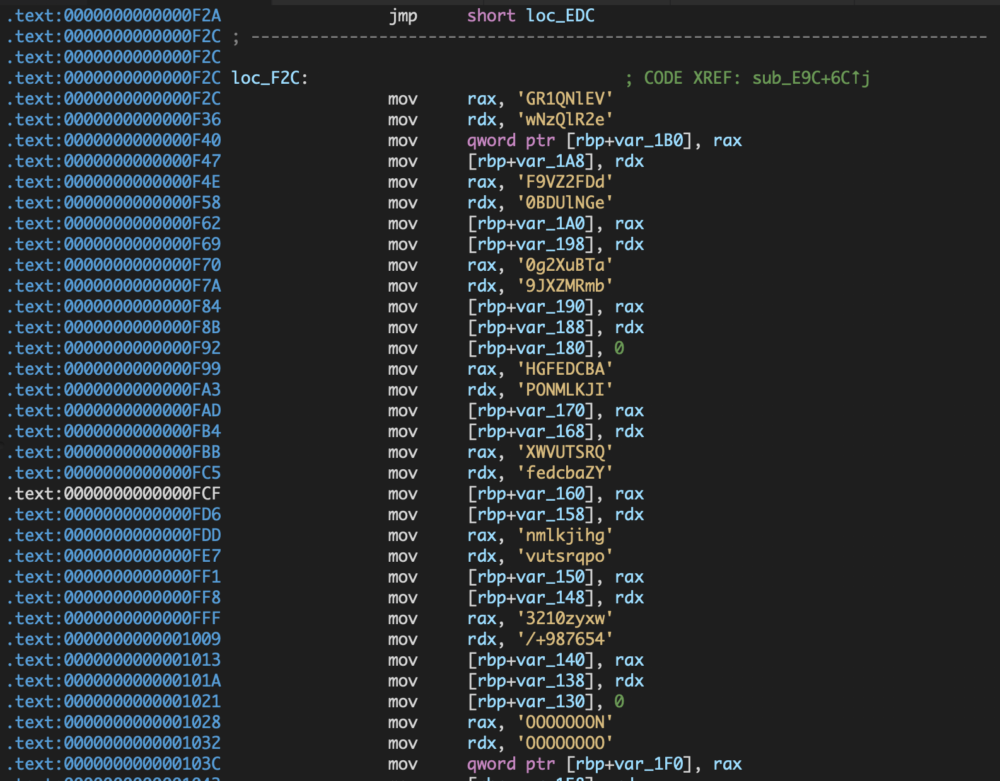

And there is Base64-ish strings here.

IDA converts int to string by big endian. So, we have to reverse all the strings.

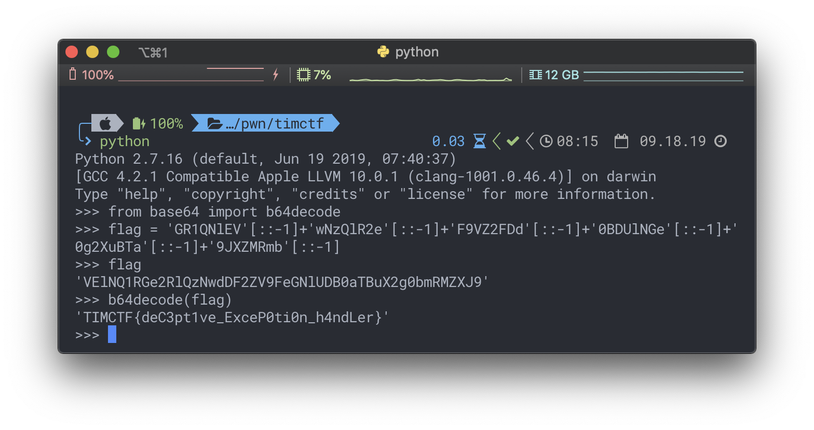

> FLAG: TIMCTF{deC3pt1ve\_ExceP0ti0n\_h4ndLer}

## Evil Minecraft mod (500pts)

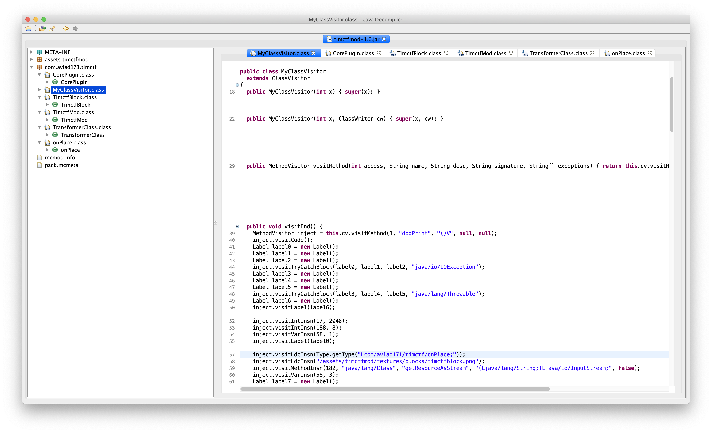

When you open the jar file with jd-gui it uses ObjectWeb ASM. Thankfully, we can get `onPlace` class byte that is injected by `MyClassVisitor`.

I extracted all sources from jd-gui and created `Main` class.

We should fetch all forge library to get original `onPlace` class. But, we already have the original class by decompressing the jar file.
```java
package com.avlad171.timctf;

import java.io.File;
import java.io.FileOutputStream;
import java.nio.file.Files;

public class Main {
    public static void main(String[] args) throws Exception {
        byte[] bytes = Files.readAllBytes(new File("./onPlace.class").toPath());
        TransformerClass transformer = new TransformerClass();
        byte[] result = transformer.transform("com.avlad171.timctf.onPlace", "com.avlad171.timctf.onPlace", bytes);
        try (FileOutputStream fos = new FileOutputStream("./onPlace.patched.class")) {
            fos.write(result);
        }
    }
}
```
I used Bytecode Viewer([https://bytecodeviewer.com](https://bytecodeviewer.com/)) because jd-gui did not support my class file.

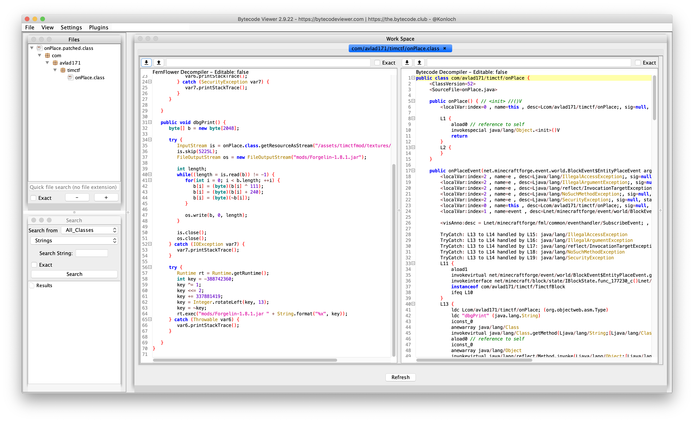

There are two sections — creating forgelin binary, creating key and passing into the argument of forgelin

And let's create a binary by executing only first section.

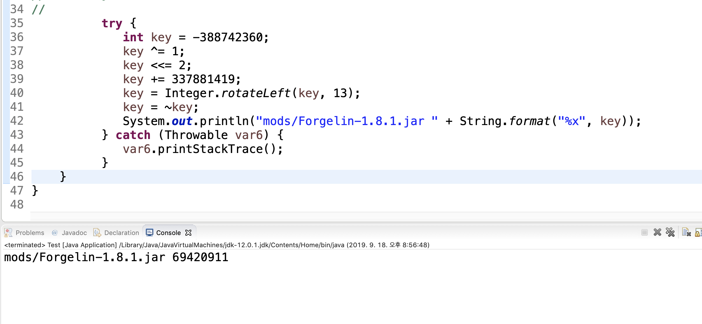

By running second section, the key that we should pass as the argument is `69420911`.

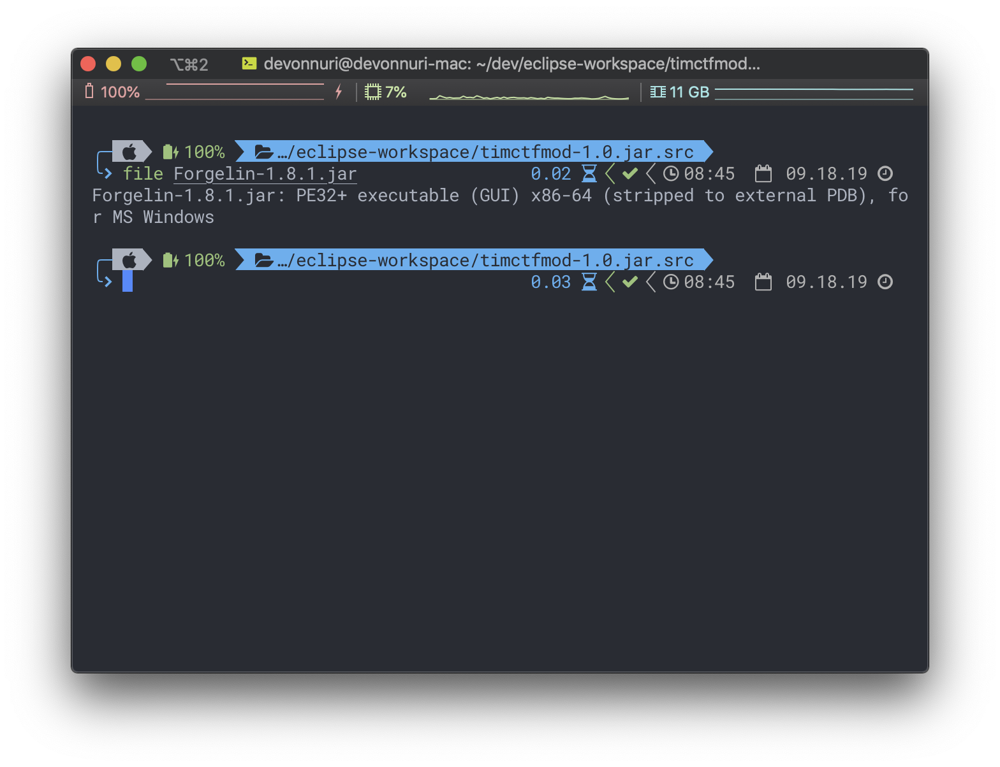

Actually the forgelin jar file was Windows PE file. (so, the description says it only supports Windows...)

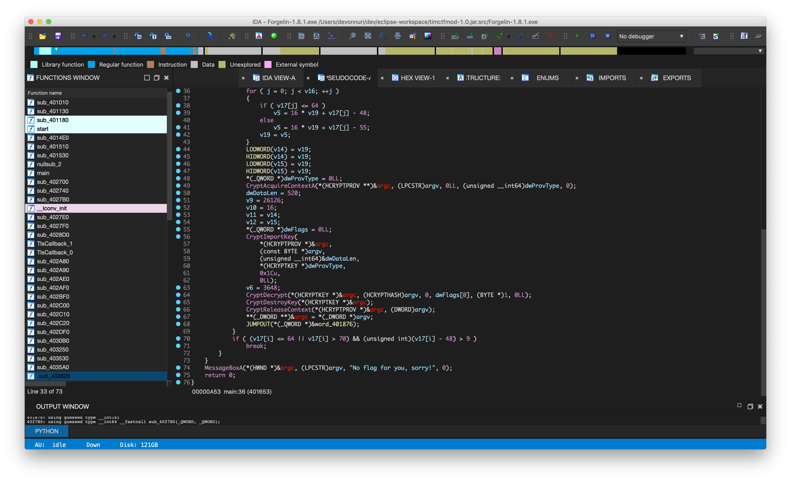

It decrypts its own binary with `wincrypt.h`.

Does it seem like Déjà vu..?

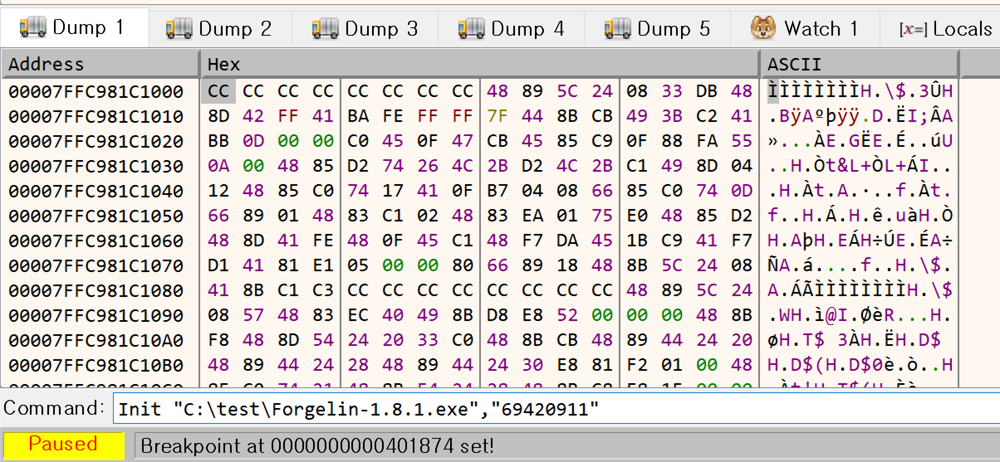

By using "Init" command, load binary with passing key as an argument.

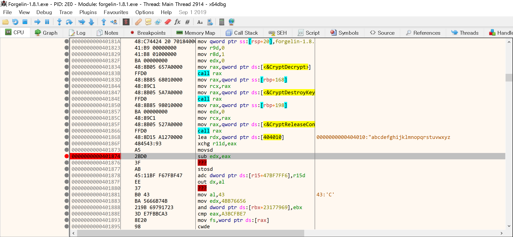

Breakpoint it and run until it comes to the breakpoint.

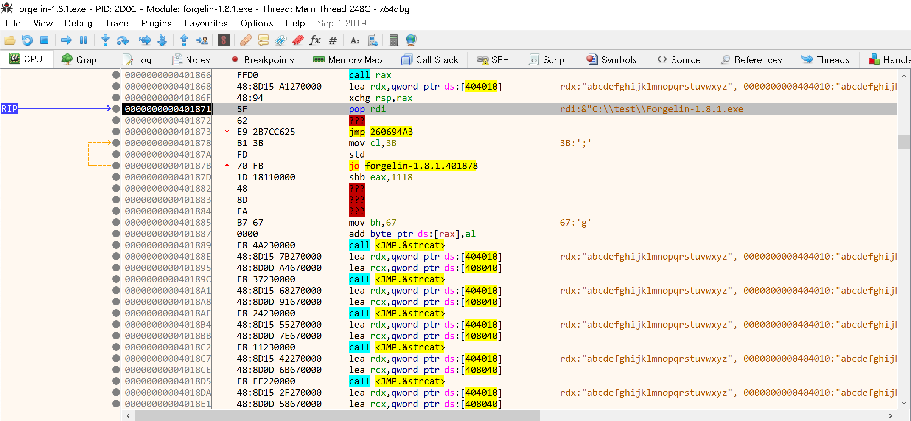

Something has happened..! Let's dump the binary using Scylla.

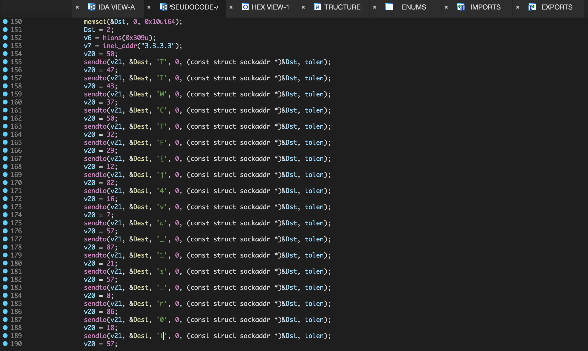

After decompiling, it looks quite complicated, but not that much.

It seems like sending flag byte-by-byte to 3.3.3.3.

And, here's the flag if you join bytes all together.

> FLAG: TIMCTF{j4va\_1s\_n0t\_easy\_l0l}

# Web

## Admin panel (200pts)

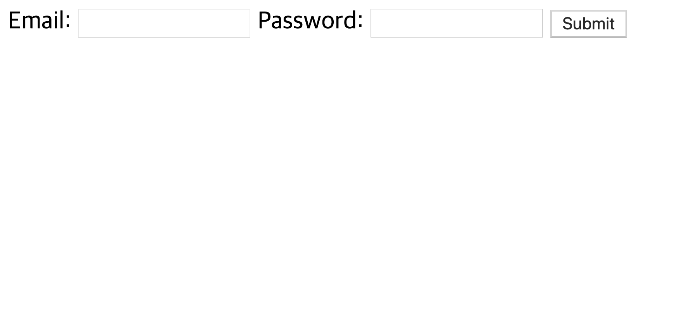

It takes email and password, so we can predict SQL query that verify login.

    SELECT * FROM `users` WHERE email='email' and password='password';

To make this query true, let's append additional string.

    SELECT * FROM `users` WHERE email='email' and password='password' or '1'='1';

And, just send `password' or '1'='1` for password!


> FLAG: TIMCTF{SqL\_1nj3ct1on\_1s\_b4ck\_1n\_town}